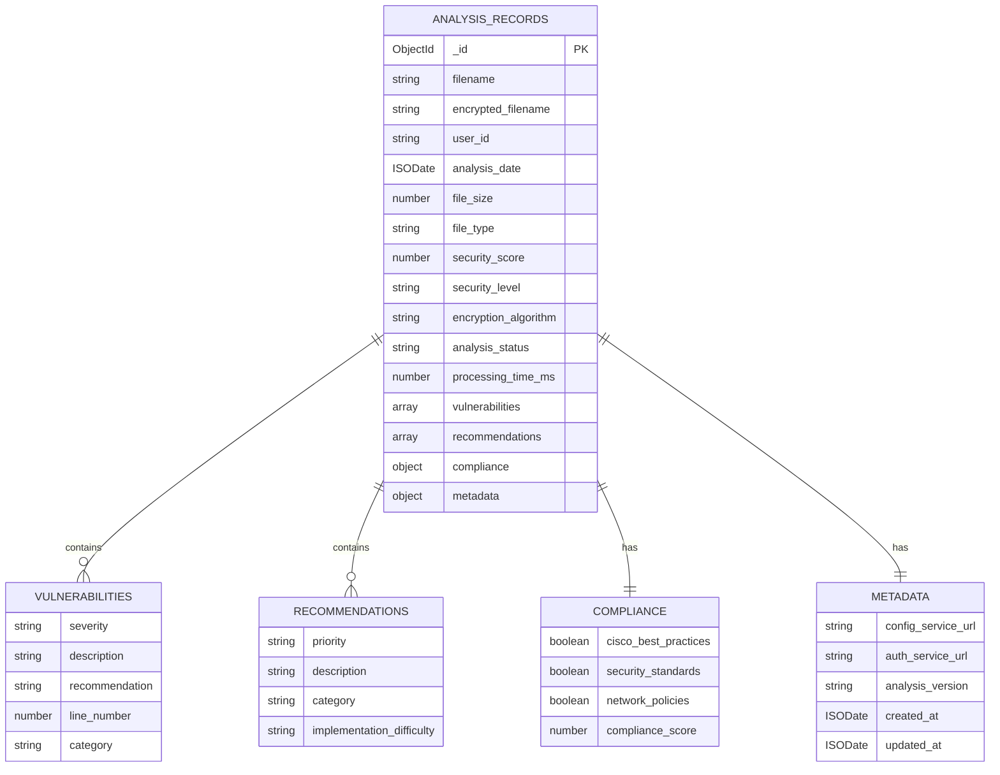

# Diagrama de Base de Datos - Analysis Service

## Descripción General

El Analysis Service utiliza MongoDB como base de datos para almacenar los registros de análisis de configuraciones de red. La base de datos está diseñada para mantener un historial completo de todos los análisis realizados, incluyendo metadatos, resultados de seguridad, vulnerabilidades identificadas y recomendaciones generadas.

## Base de Datos: `analysis_service`

### Colección Principal: `analysis_records`

#### Esquema del Documento

```json
{
  "_id": "ObjectId",
  "filename": "string",
  "encrypted_filename": "string",
  "user_id": "string",
  "analysis_date": "ISODate",
  "file_size": "number",
  "file_type": "string",
  "security_score": "number",
  "security_level": "string",
  "encryption_algorithm": "string",
  "analysis_status": "string",
  "processing_time_ms": "number",
  "vulnerabilities": [
    {
      "severity": "string",
      "description": "string",
      "recommendation": "string",
      "line_number": "number",
      "category": "string"
    }
  ],
  "recommendations": [
    {
      "priority": "string",
      "description": "string",
      "category": "string",
      "implementation_difficulty": "string"
    }
  ],
  "compliance": {
    "cisco_best_practices": "boolean",
    "security_standards": "boolean",
    "network_policies": "boolean",
    "compliance_score": "number"
  },
  "metadata": {
    "config_service_url": "string",
    "auth_service_url": "string",
    "analysis_version": "string",
    "created_at": "ISODate",
    "updated_at": "ISODate"
  }
}
```

## Diagrama ER (Entity Relationship)



## Descripción Detallada de Campos

### Campos Principales

| Campo | Tipo | Descripción | Ejemplo |
|-------|------|-------------|---------|
| `_id` | ObjectId | Identificador único del documento | `507f1f77bcf86cd799439011` |
| `filename` | String | Nombre original del archivo analizado | `"show_running.txt"` |
| `encrypted_filename` | String | Nombre encriptado usado para comunicación | `"U2FsdGVkX1..."` |
| `user_id` | String | ID del usuario que solicitó el análisis | `"admin"` |
| `analysis_date` | ISODate | Fecha y hora del análisis | `2024-01-15T10:30:00Z` |
| `file_size` | Number | Tamaño del archivo en bytes | `12288` |
| `file_type` | String | Tipo de configuración detectado | `"network_config"` |
| `security_score` | Number | Puntuación de seguridad (0-100) | `85` |
| `security_level` | String | Nivel de seguridad categorizado | `"high"` |
| `encryption_algorithm` | String | Algoritmo de encriptación usado | `"AES-256-CBC + Base64"` |
| `analysis_status` | String | Estado del análisis | `"completed"` |
| `processing_time_ms` | Number | Tiempo de procesamiento en milisegundos | `1250` |

### Array de Vulnerabilidades

```json
{
  "vulnerabilities": [
    {
      "severity": "medium",
      "description": "SNMP community string por defecto",
      "recommendation": "Cambiar community string por defecto",
      "line_number": 45,
      "category": "authentication"
    },
    {
      "severity": "high",
      "description": "Telnet habilitado sin encriptación",
      "recommendation": "Deshabilitar Telnet y usar SSH",
      "line_number": 23,
      "category": "encryption"
    }
  ]
}
```

### Array de Recomendaciones

```json
{
  "recommendations": [
    {
      "priority": "high",
      "description": "Configurar autenticación AAA",
      "category": "authentication",
      "implementation_difficulty": "medium"
    },
    {
      "priority": "medium",
      "description": "Habilitar logging de seguridad",
      "category": "monitoring",
      "implementation_difficulty": "low"
    }
  ]
}
```

### Objeto de Compliance

```json
{
  "compliance": {
    "cisco_best_practices": true,
    "security_standards": true,
    "network_policies": false,
    "compliance_score": 75
  }
}
```

### Objeto de Metadata

```json
{
  "metadata": {
    "config_service_url": "http://config-service:8000",
    "auth_service_url": "http://auth-service:8080",
    "analysis_version": "1.0.0",
    "created_at": "2024-01-15T10:30:00Z",
    "updated_at": "2024-01-15T10:30:00Z"
  }
}
```

## Índices Recomendados

### Índices Principales

```javascript
// Índice por usuario y fecha
db.analysis_records.createIndex({
  "user_id": 1,
  "analysis_date": -1
})

// Índice por nombre de archivo
db.analysis_records.createIndex({
  "filename": 1
})

// Índice por score de seguridad
db.analysis_records.createIndex({
  "security_score": -1
})

// Índice por tipo de archivo
db.analysis_records.createIndex({
  "file_type": 1
})

// Índice por fecha de análisis
db.analysis_records.createIndex({
  "analysis_date": -1
})

// Índice compuesto para búsquedas frecuentes
db.analysis_records.createIndex({
  "user_id": 1,
  "file_type": 1,
  "security_score": -1
})
```

## Consultas Comunes

### 1. Obtener Análisis por Usuario

```javascript
db.analysis_records.find({
  "user_id": "admin"
}).sort({
  "analysis_date": -1
})
```

### 2. Análisis con Score Bajo

```javascript
db.analysis_records.find({
  "security_score": { $lt: 50 }
}).sort({
  "security_score": 1
})
```

### 3. Vulnerabilidades Críticas

```javascript
db.analysis_records.find({
  "vulnerabilities.severity": "high"
})
```

### 4. Estadísticas por Tipo de Archivo

```javascript
db.analysis_records.aggregate([
  {
    $group: {
      _id: "$file_type",
      count: { $sum: 1 },
      avg_score: { $avg: "$security_score" },
      min_score: { $min: "$security_score" },
      max_score: { $max: "$security_score" }
    }
  }
])
```

### 5. Análisis Recientes

```javascript
db.analysis_records.find({
  "analysis_date": {
    $gte: new Date(Date.now() - 24*60*60*1000)
  }
})
```

## Monitoreo y Métricas

### Consultas de Monitoreo

```javascript
// Total de análisis por día
db.analysis_records.aggregate([
  {
    $group: {
      _id: {
        $dateToString: {
          format: "%Y-%m-%d",
          date: "$analysis_date"
        }
      },
      count: { $sum: 1 }
    }
  },
  { $sort: { "_id": -1 } }
])

// Tiempo promedio de procesamiento
db.analysis_records.aggregate([
  {
    $group: {
      _id: null,
      avg_processing_time: { $avg: "$processing_time_ms" }
    }
  }
])

// Distribución de scores de seguridad
db.analysis_records.aggregate([
  {
    $bucket: {
      groupBy: "$security_score",
      boundaries: [0, 25, 50, 75, 100],
      default: "100+",
      output: {
        count: { $sum: 1 }
      }
    }
  }
])
```

## Estrategias de Backup y Recuperación

### Backup Automático

```javascript
// Script de backup diario
db.analysis_records.find({
  "analysis_date": {
    $gte: new Date(Date.now() - 7*24*60*60*1000)
  }
}).forEach(function(doc) {
  // Lógica de backup
})
```

### Limpieza de Datos Antiguos

```javascript
// Eliminar análisis de más de 90 días
db.analysis_records.deleteMany({
  "analysis_date": {
    $lt: new Date(Date.now() - 90*24*60*60*1000)
  }
})
```

## Seguridad de la Base de Datos

### Configuración de Seguridad

```javascript
// Crear usuario con permisos limitados
db.createUser({
  user: "analysis_service_user",
  pwd: "secure_password",
  roles: [
    {
      role: "readWrite",
      db: "analysis_service"
    }
  ]
})

// Configurar autenticación
db.runCommand({
  setParameter: 1,
  authenticationMechanisms: ["SCRAM-SHA-256"]
})
```

### Encriptación de Datos Sensibles

```javascript
// Los nombres de archivos se almacenan encriptados
// El contenido del análisis se almacena de forma segura
// Las credenciales de usuario se referencian, no se almacenan
```

## Escalabilidad y Rendimiento

### Estrategias de Escalabilidad

1. **Sharding**: Distribuir datos por rango de fechas
2. **Replicación**: Configurar réplicas para alta disponibilidad
3. **Índices**: Optimizar consultas frecuentes
4. **TTL Indexes**: Eliminación automática de datos antiguos

### Configuración de TTL

```javascript
// Eliminar análisis de más de 1 año automáticamente
db.analysis_records.createIndex(
  { "analysis_date": 1 },
  { expireAfterSeconds: 365*24*60*60 }
)
```

## Troubleshooting

### Problemas Comunes

1. **Conexión Rechazada**:
   ```javascript
   // Verificar estado de la conexión
   db.runCommand({ ping: 1 })
   ```

2. **Consultas Lentas**:
   ```javascript
   // Analizar consultas
   db.analysis_records.find().explain("executionStats")
   ```

3. **Espacio en Disco**:
   ```javascript
   // Verificar tamaño de la base de datos
   db.stats()
   ```

### Logs de Base de Datos

```javascript
// Habilitar logs detallados
db.setLogLevel(1, "query")
db.setLogLevel(1, "connection")
```

## Migración de Datos

### Script de Migración

```javascript
// Migrar datos de versión anterior
db.analysis_records.find().forEach(function(doc) {
  if (!doc.metadata) {
    db.analysis_records.updateOne(
      { _id: doc._id },
      {
        $set: {
          metadata: {
            analysis_version: "1.0.0",
            created_at: doc.analysis_date,
            updated_at: new Date()
          }
        }
      }
    )
  }
})
```

## Integración con el Sistema

### Conexión desde el Servicio

```python
# Ejemplo de conexión desde Python
from pymongo import MongoClient

client = MongoClient('mongodb://localhost:27017/')
db = client['analysis_service']
collection = db['analysis_records']
```

### Operaciones CRUD

```python
# Insertar análisis
analysis_record = {
    "filename": "show_running.txt",
    "user_id": "admin",
    "security_score": 85,
    # ... otros campos
}
result = collection.insert_one(analysis_record)

# Consultar análisis
analyses = collection.find({"user_id": "admin"}).sort("analysis_date", -1)
``` 