# Diagramas de Flujo - Analysis Service

## 1. Flujo Principal de Análisis

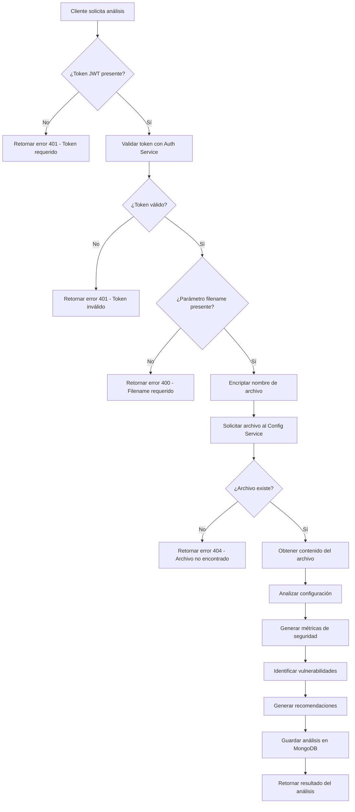

## 2. Flujo de Health Check

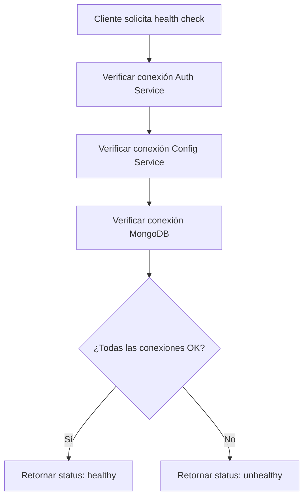

## 3. Flujo de Autenticación

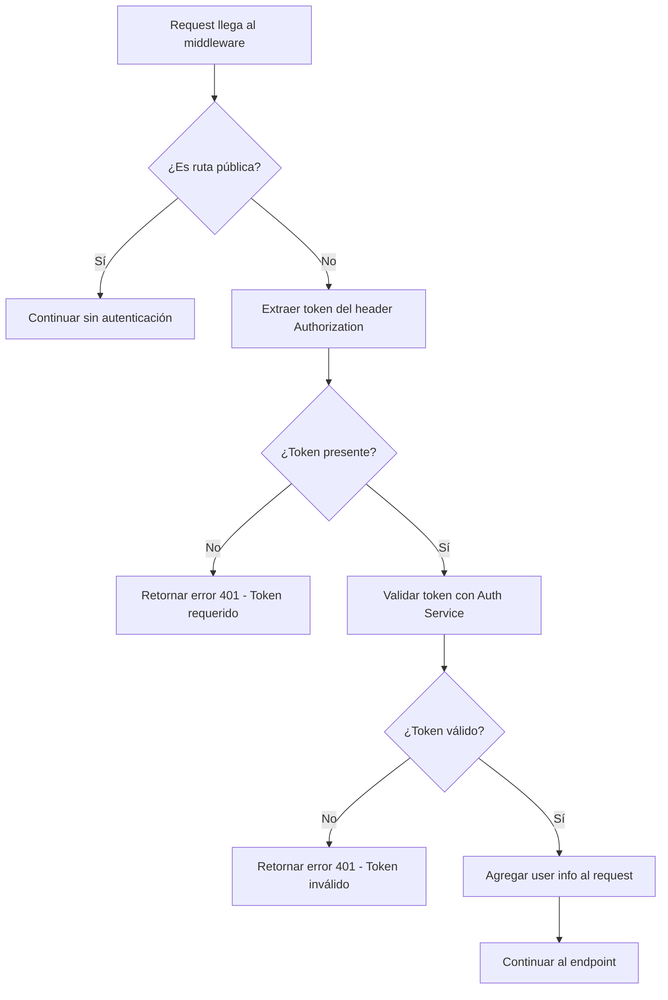

## 4. Flujo de Análisis de Configuración

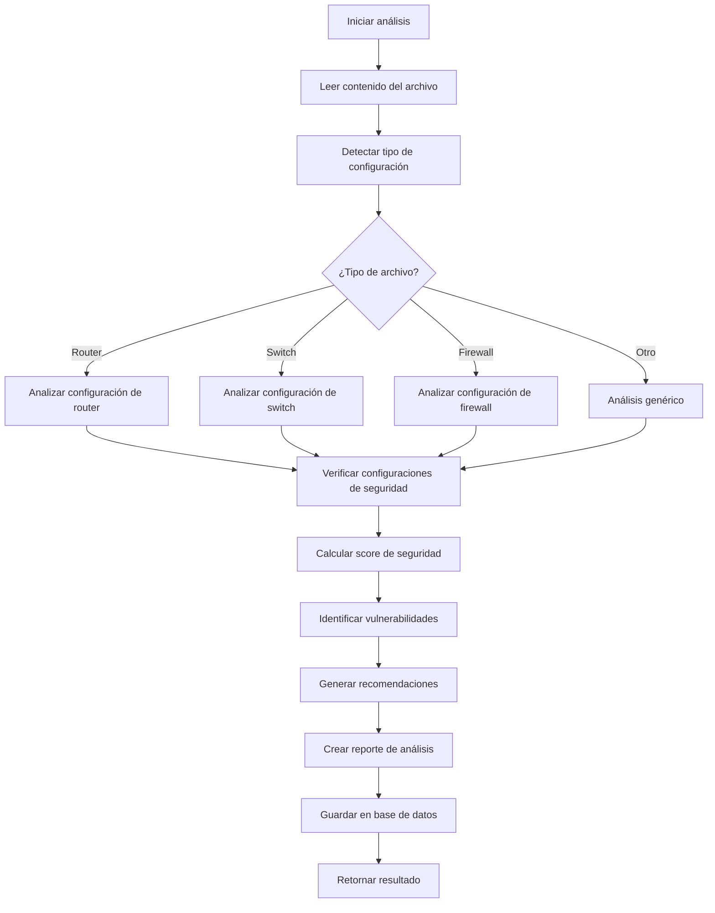

## 5. Flujo de Manejo de Errores

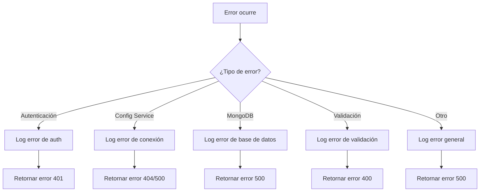

## 6. Flujo de Inicialización del Servicio

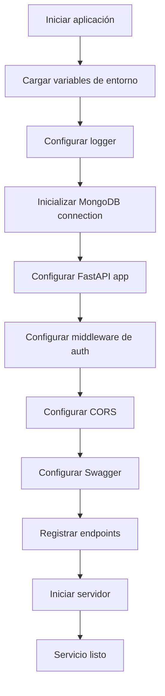

## 7. Flujo de Logging

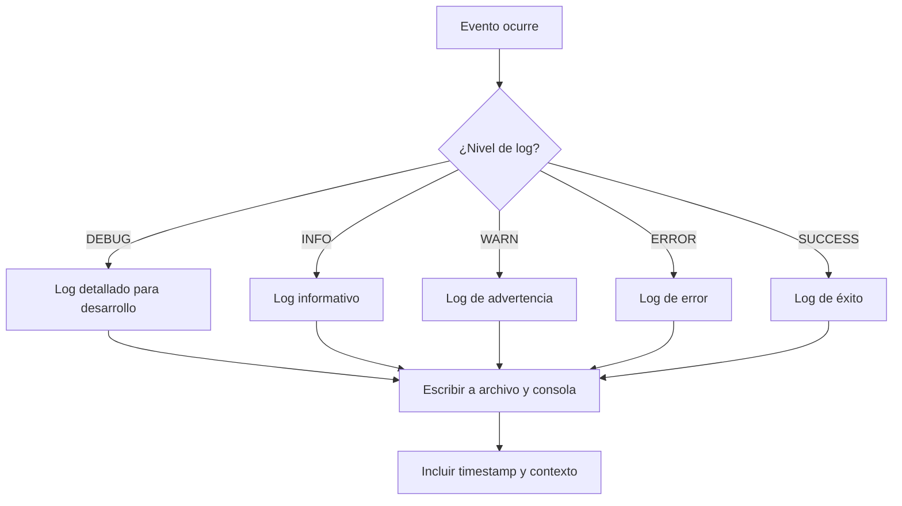

## 8. Flujo de Integración con Config Service

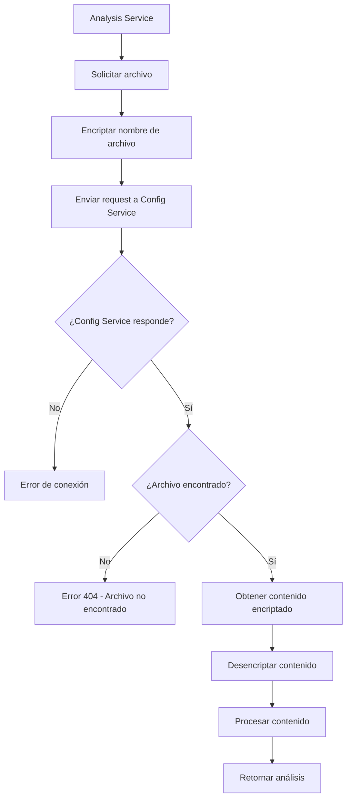

## 9. Flujo de Validación de Datos

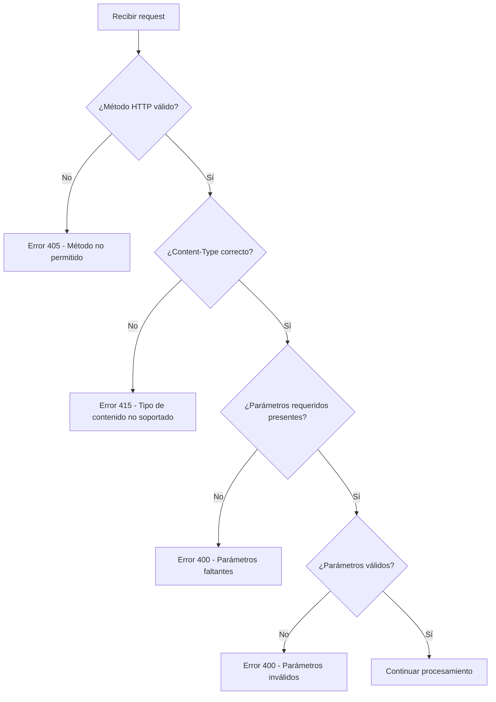

## 10. Flujo de Almacenamiento en MongoDB

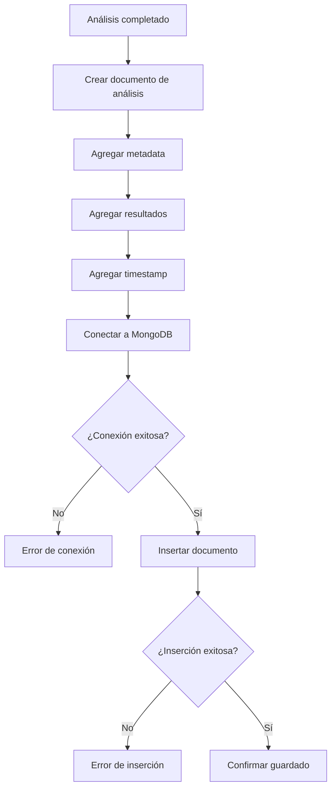

## 11. Flujo de Cálculo de Score de Seguridad

```mermaid
flowchart TD
    A[Analizar configuración] --> B[Verificar autenticación AAA]
    B --> C[Verificar logging de seguridad]
    C --> D[Verificar configuración SNMP]
    D --> E[Verificar políticas de acceso]
    E --> F[Verificar configuración de red]
    F --> G[Calcular puntuación base]
    G --> H[Restar puntos por vulnerabilidades]
    H --> I[Sumar puntos por buenas prácticas]
    I --> J[Normalizar score (0-100)]
    J --> K[Asignar nivel de seguridad]
    K --> L[Retornar score final]
```

## 12. Flujo de Generación de Recomendaciones

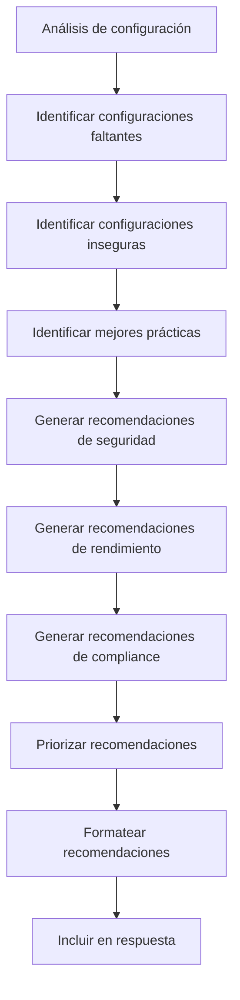