# Diagramas de Secuencia - Analysis Service

## 1. Secuencia de Análisis Exitoso

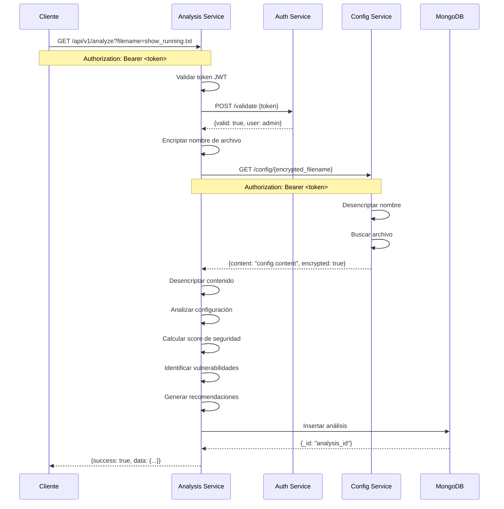

## 2. Secuencia de Error de Autenticación

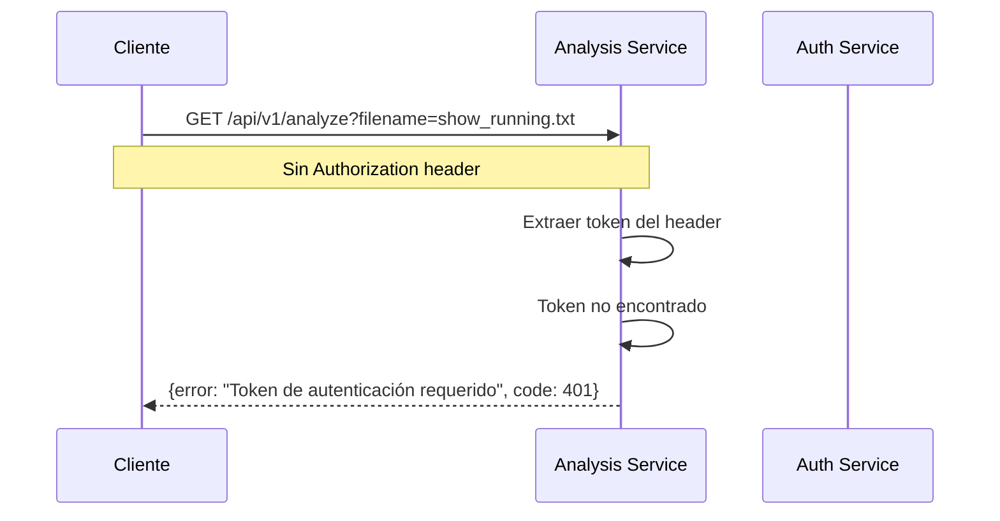

## 3. Secuencia de Token Inválido

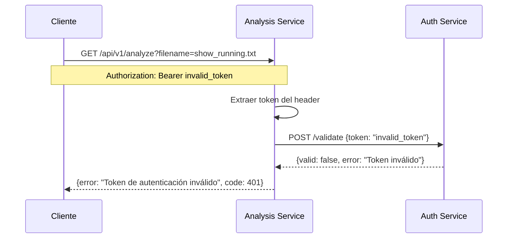

## 4. Secuencia de Archivo No Encontrado

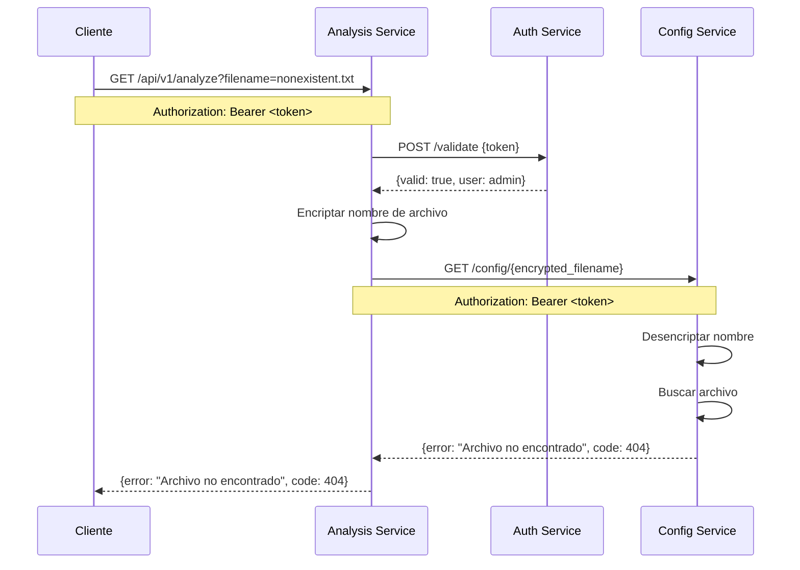

## 5. Secuencia de Health Check

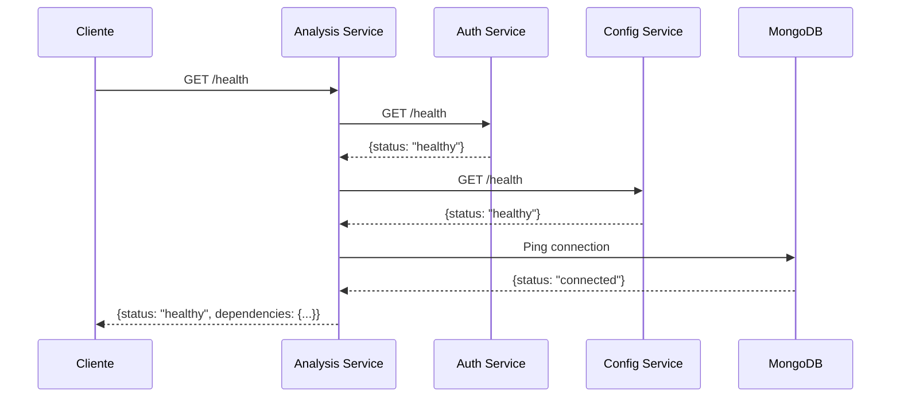

## 6. Secuencia de Inicialización del Servicio

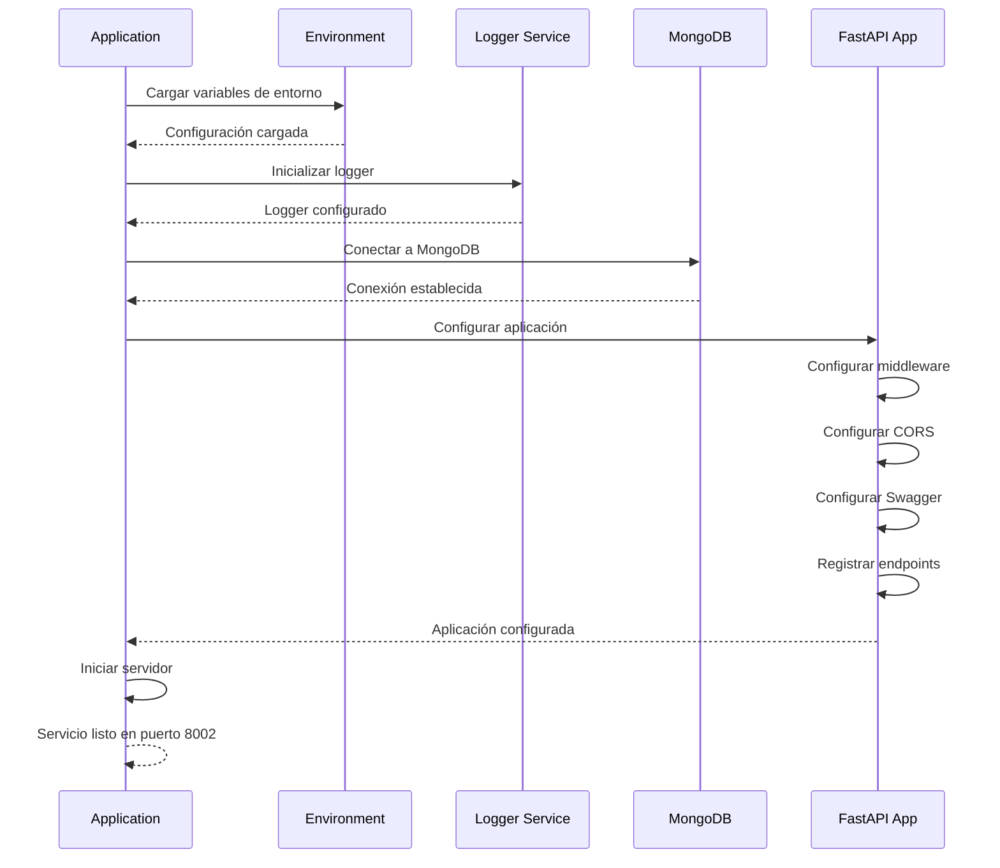

## 7. Secuencia de Error de Conexión a Config Service

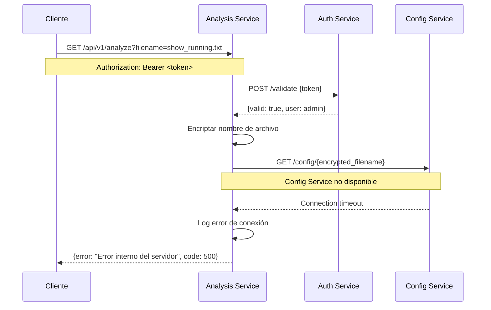

## 8. Secuencia de Error de Base de Datos

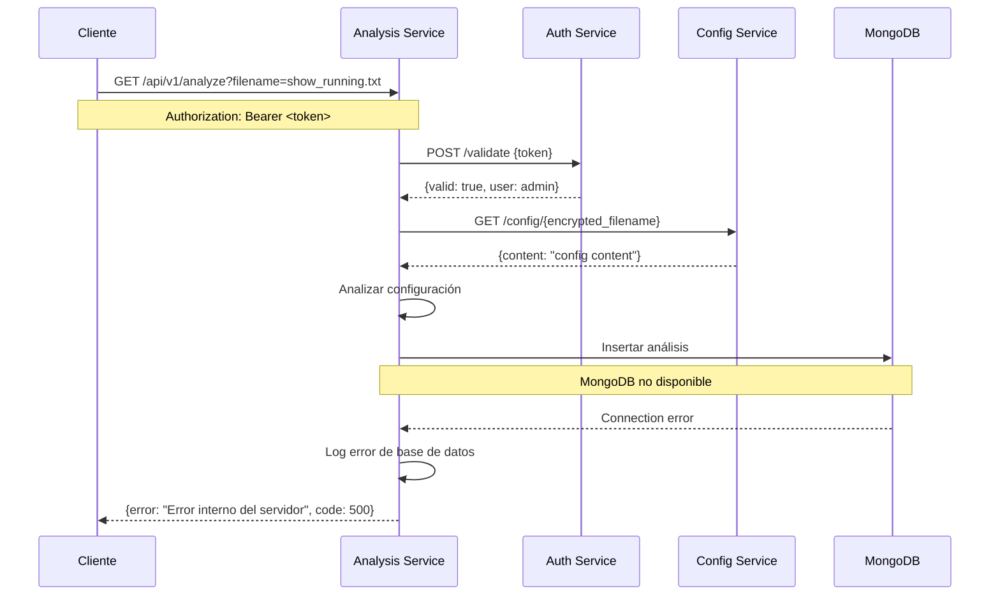

## 9. Secuencia de Validación de Parámetros

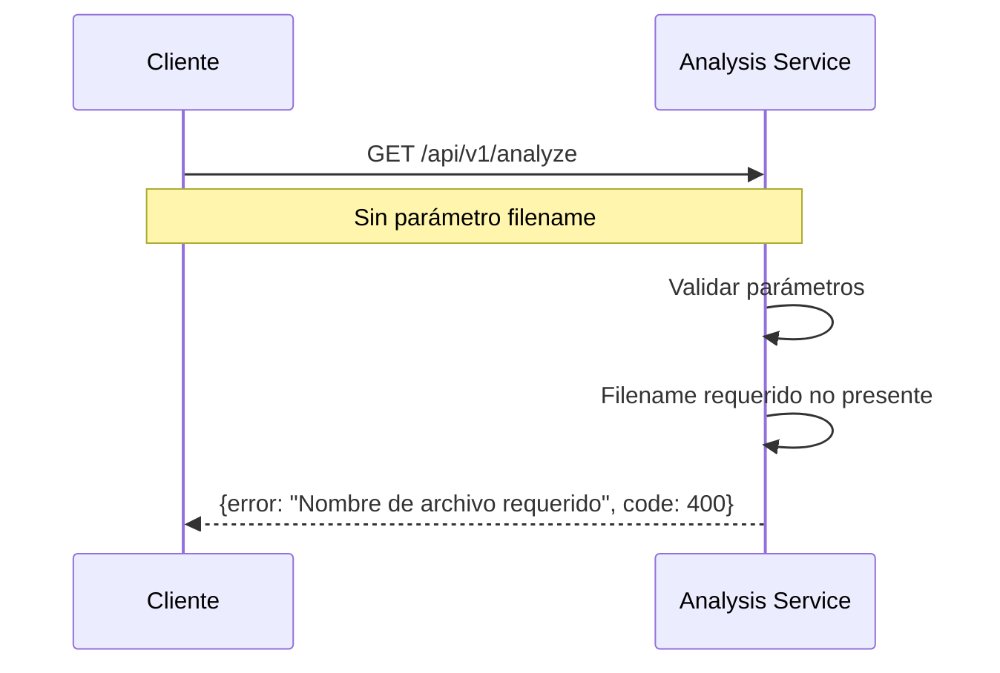

## 10. Secuencia de Análisis de Configuración de Router

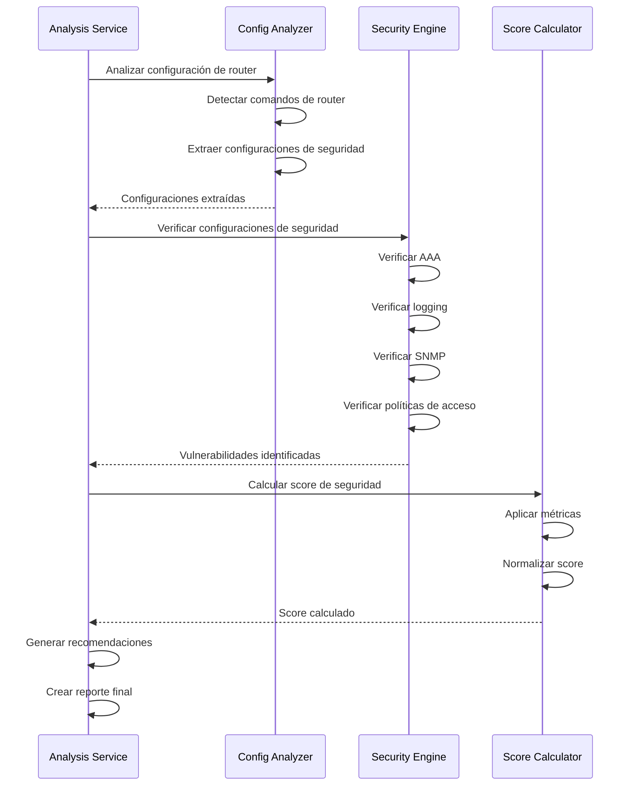

## 11. Secuencia de Middleware de Autenticación

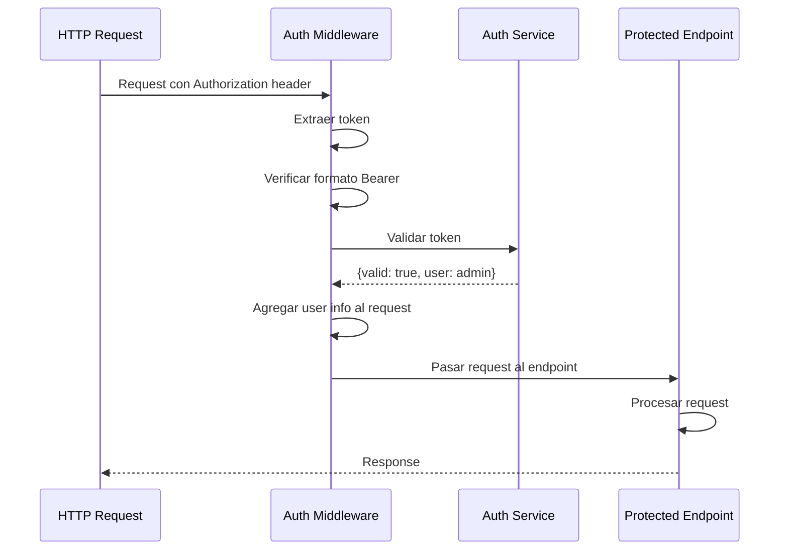

## 12. Secuencia de Logging Estructurado

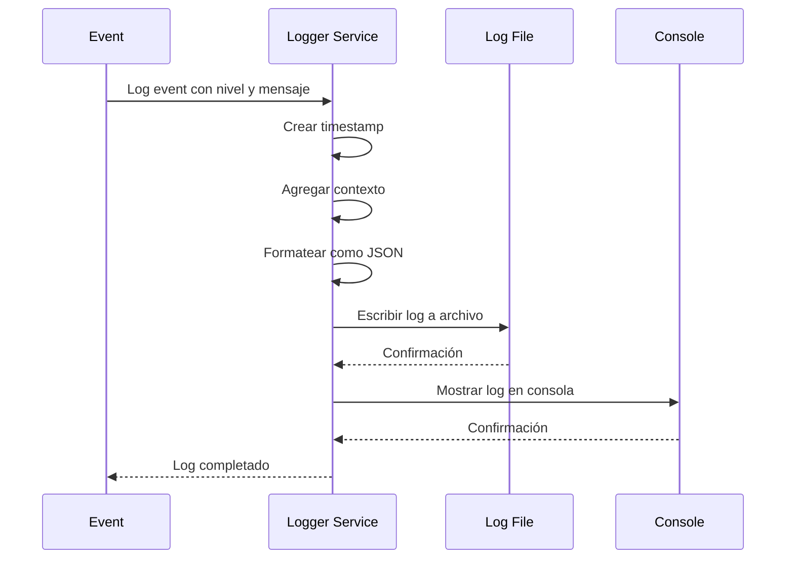

## 13. Secuencia de Integración con Analysis Service

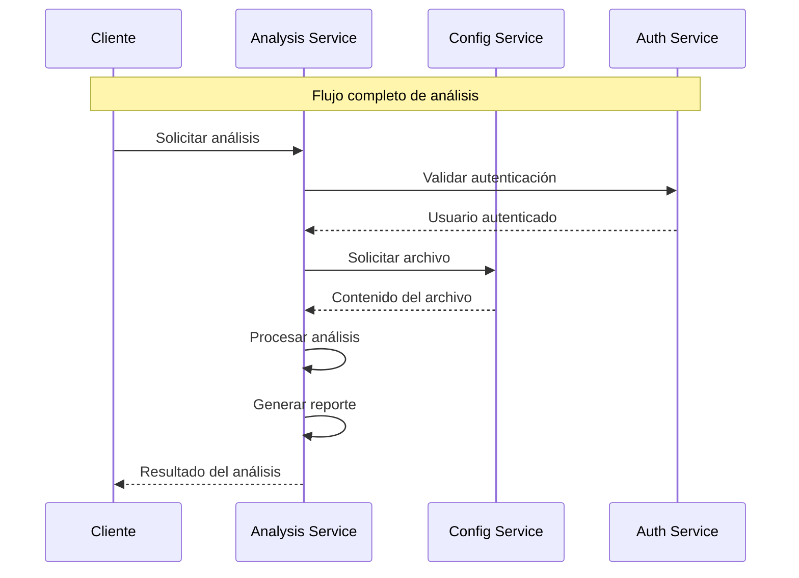

## 14. Secuencia de Manejo de Errores

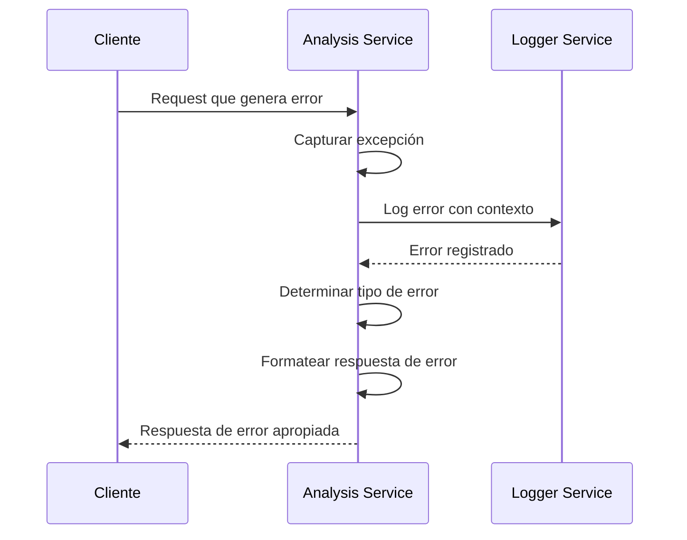