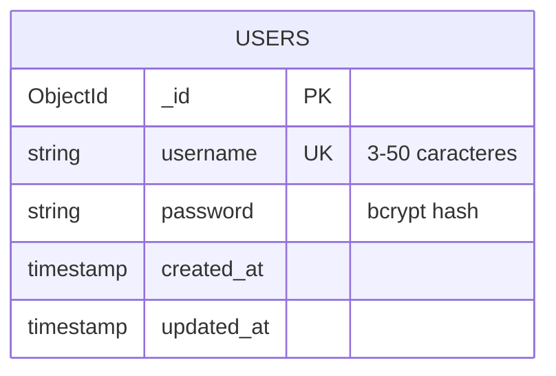

# Diagrama de Base de Datos - Auth Service

## Descripción General

El **Auth Service** utiliza **MongoDB** como base de datos principal para almacenar información de usuarios y gestionar la autenticación. La base de datos está diseñada para ser simple pero eficiente, manteniendo solo la información esencial para la autenticación.

## Esquema de Base de Datos

### Base de Datos: `auth_service`

```
auth_service/
└── collections/
    └── users/
        └── documents/
            ├── _id: ObjectId
            ├── username: string (único)
            ├── password: string (encriptado)
            ├── created_at: timestamp
            └── updated_at: timestamp
```

## Diagrama ER (Entidad-Relación)



## Estructura Detallada de Colecciones

### Colección: `users`

| Campo | Tipo | Descripción | Restricciones | Ejemplo |
|-------|------|-------------|---------------|---------|
| `_id` | ObjectId | Identificador único del documento | Auto-generado | `507f1f77bcf86cd799439011` |
| `username` | String | Nombre de usuario único | 3-50 caracteres, solo letras, números, guiones y guiones bajos | `"admin"` |
| `password` | String | Contraseña encriptada | Hash bcrypt con salt | `"$2a$10$..."` |
| `created_at` | Timestamp | Fecha de creación del usuario | Auto-generado | `2024-01-15T10:30:00Z` |
| `updated_at` | Timestamp | Fecha de última actualización | Auto-actualizado | `2024-01-15T10:30:00Z` |

## Índices de Base de Datos

### Índices Principales

```javascript
// Índice único en username para búsquedas rápidas
db.users.createIndex(
    { "username": 1 }, 
    { 
        unique: true,
        name: "username_unique_index"
    }
)

// Índice en created_at para consultas de auditoría
db.users.createIndex(
    { "created_at": 1 },
    { name: "created_at_index" }
)

// Índice compuesto para consultas de mantenimiento
db.users.createIndex(
    { "username": 1, "created_at": 1 },
    { name: "username_created_at_index" }
)
```

## Documento de Usuario de Ejemplo

```json
{
  "_id": ObjectId("507f1f77bcf86cd799439011"),
  "username": "admin",
  "password": "$2a$10$N9qo8uLOickgx2ZMRZoMyeIjZAgcfl7p92ldGxad68LJZdL17lhWy",
  "created_at": ISODate("2024-01-15T10:30:00.000Z"),
  "updated_at": ISODate("2024-01-15T10:30:00.000Z")
}
```

## Consultas de Base de Datos

### Consultas Principales

#### 1. Buscar Usuario por Username
```javascript
db.users.findOne({ "username": "admin" })
```

#### 2. Crear Nuevo Usuario
```javascript
db.users.insertOne({
  "username": "nuevo_usuario",
  "password": "$2a$10$...", // Hash bcrypt
  "created_at": new Date(),
  "updated_at": new Date()
})
```

#### 3. Verificar Existencia de Usuario
```javascript
db.users.countDocuments({ "username": "admin" })
```

#### 4. Actualizar Timestamp de Usuario
```javascript
db.users.updateOne(
  { "username": "admin" },
  { "$set": { "updated_at": new Date() } }
)
```

#### 5. Eliminar Usuario (si es necesario)
```javascript
db.users.deleteOne({ "username": "usuario_a_eliminar" })
```

## Consultas de Monitoreo

### 1. Estadísticas de Usuarios
```javascript
// Total de usuarios
db.users.countDocuments()

// Usuarios creados en los últimos 30 días
db.users.countDocuments({
  "created_at": { 
    "$gte": new Date(Date.now() - 30 * 24 * 60 * 60 * 1000) 
  }
})
```

### 2. Usuarios por Fecha de Creación
```javascript
db.users.aggregate([
  {
    "$group": {
      "_id": {
        "year": { "$year": "$created_at" },
        "month": { "$month": "$created_at" },
        "day": { "$dayOfMonth": "$created_at" }
      },
      "count": { "$sum": 1 }
    }
  },
  { "$sort": { "_id": 1 } }
])
```

### 3. Usuarios Más Recientes
```javascript
db.users.find()
  .sort({ "created_at": -1 })
  .limit(10)
  .project({ "username": 1, "created_at": 1, "_id": 0 })
```

## Configuración de MongoDB

### Variables de Entorno
```bash
# Conexión a MongoDB
MONGO_URI=mongodb://mongodb_meli_db:27017
MONGO_DATABASE=auth_service

# Configuración adicional (opcional)
MONGO_USERNAME=admin
MONGO_PASSWORD=password
MONGO_AUTH_SOURCE=admin
```

### Configuración de Conexión
```go
// Ejemplo de configuración en Go
mongoURI := os.Getenv("MONGO_URI")
databaseName := os.Getenv("MONGO_DATABASE")

clientOptions := options.Client().ApplyURI(mongoURI)
client, err := mongo.Connect(context.Background(), clientOptions)
if err != nil {
    log.Fatal(err)
}

database := client.Database(databaseName)
collection := database.Collection("users")
```

## Estrategias de Backup y Recuperación

### Backup Automático
```bash
# Backup completo de la base de datos
mongodump --uri="mongodb://localhost:27017/auth_service" --out=/backup/$(date +%Y%m%d)

# Backup de colección específica
mongodump --uri="mongodb://localhost:27017/auth_service" --collection=users --out=/backup/users
```

### Restauración
```bash
# Restaurar base de datos completa
mongorestore --uri="mongodb://localhost:27017/auth_service" /backup/20240115/

# Restaurar colección específica
mongorestore --uri="mongodb://localhost:27017/auth_service" --collection=users /backup/users/auth_service/users.bson
```

## Seguridad de Base de Datos

### 1. Encriptación de Contraseñas
- **Algoritmo**: bcrypt
- **Salt Rounds**: 10
- **Ejemplo**: `$2a$10$N9qo8uLOickgx2ZMRZoMyeIjZAgcfl7p92ldGxad68LJZdL17lhWy`

### 2. Validación de Datos
```javascript
// Validación a nivel de base de datos
db.runCommand({
  collMod: "users",
  validator: {
    $jsonSchema: {
      bsonType: "object",
      required: ["username", "password", "created_at", "updated_at"],
      properties: {
        username: {
          bsonType: "string",
          minLength: 3,
          maxLength: 50,
          pattern: "^[a-zA-Z0-9_-]+$"
        },
        password: {
          bsonType: "string",
          minLength: 60 // bcrypt hash length
        },
        created_at: { bsonType: "date" },
        updated_at: { bsonType: "date" }
      }
    }
  }
})
```

### 3. Control de Acceso
```javascript
// Crear usuario de aplicación con permisos limitados
use admin
db.createUser({
  user: "auth_service_user",
  pwd: "secure_password",
  roles: [
    {
      role: "readWrite",
      db: "auth_service"
    }
  ]
})
```

## Métricas y Monitoreo

### 1. Métricas de Rendimiento
```javascript
// Estadísticas de colección
db.users.stats()

// Información de índices
db.users.getIndexes()

// Estadísticas de consultas
db.users.aggregate([
  { "$collStats": { "latencyStats": { "histograms": true } } }
])
```

### 2. Consultas de Auditoría
```javascript
// Usuarios creados en el último mes
db.users.find({
  "created_at": {
    "$gte": new Date(new Date().setMonth(new Date().getMonth() - 1))
  }
}).count()

// Últimos usuarios creados
db.users.find()
  .sort({ "created_at": -1 })
  .limit(5)
  .project({ "username": 1, "created_at": 1 })
```

### 3. Alertas de Seguridad
```javascript
// Detectar intentos de creación de usuarios duplicados
db.users.find({
  "username": { "$in": ["admin", "root", "administrator"] }
})

// Verificar usuarios sin password válido
db.users.find({
  "password": { "$not": /^\$2a\$10\$/ }
})
```

## Mantenimiento de Base de Datos

### 1. Limpieza de Datos
```javascript
// Eliminar usuarios inactivos (ejemplo)
db.users.deleteMany({
  "updated_at": {
    "$lt": new Date(Date.now() - 365 * 24 * 60 * 60 * 1000) // 1 año
  }
})
```

### 2. Optimización de Índices
```javascript
// Reconstruir índices
db.users.reIndex()

// Analizar uso de índices
db.users.aggregate([
  { "$indexStats": {} }
])
```

### 3. Compresión de Datos
```javascript
// Comprimir colección
db.runCommand({
  compact: "users",
  force: true
})
```

## Migraciones de Base de Datos

### 1. Agregar Nuevo Campo
```javascript
// Agregar campo de estado de usuario
db.users.updateMany(
  {},
  { "$set": { "status": "active" } }
)

// Crear índice para el nuevo campo
db.users.createIndex({ "status": 1 })
```

### 2. Migración de Estructura
```javascript
// Ejemplo: migrar formato de username
db.users.find().forEach(function(user) {
  db.users.updateOne(
    { "_id": user._id },
    { "$set": { "username_lower": user.username.toLowerCase() } }
  )
})
```

## Consideraciones de Escalabilidad

### 1. Sharding (para grandes volúmenes)
```javascript
// Habilitar sharding en la base de datos
sh.enableSharding("auth_service")

// Shardear por username
sh.shardCollection("auth_service.users", { "username": 1 })
```

### 2. Replicación
```javascript
// Configurar replica set
rs.initiate({
  _id: "auth_replica_set",
  members: [
    { _id: 0, host: "mongodb1:27017" },
    { _id: 1, host: "mongodb2:27017" },
    { _id: 2, host: "mongodb3:27017" }
  ]
})
```

## Troubleshooting

### Problemas Comunes

#### 1. Error de Conexión
```javascript
// Verificar conectividad
db.runCommand({ ping: 1 })

// Verificar estado de la base de datos
db.serverStatus()
```

#### 2. Error de Índice Único
```javascript
// Verificar duplicados
db.users.aggregate([
  { "$group": { "_id": "$username", "count": { "$sum": 1 } } },
  { "$match": { "count": { "$gt": 1 } } }
])
```

#### 3. Problemas de Rendimiento
```javascript
// Analizar consultas lentas
db.users.find().explain("executionStats")

// Verificar uso de índices
db.users.find({ "username": "admin" }).explain("executionStats")
``` 