# Diagrama de Flujo - Auth Service

## 1. Flujo Principal de Autenticación (Login)

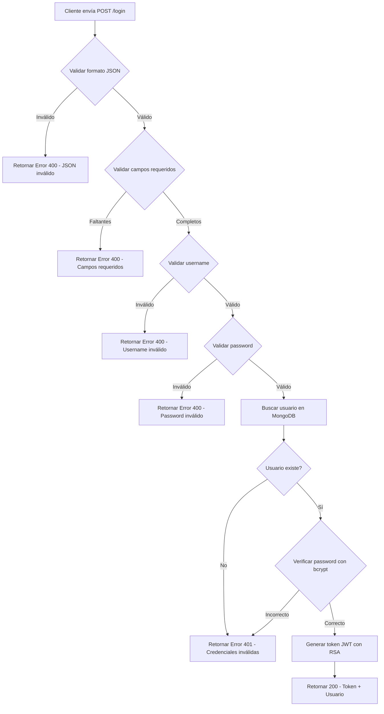

## 2. Flujo de Validación de Token

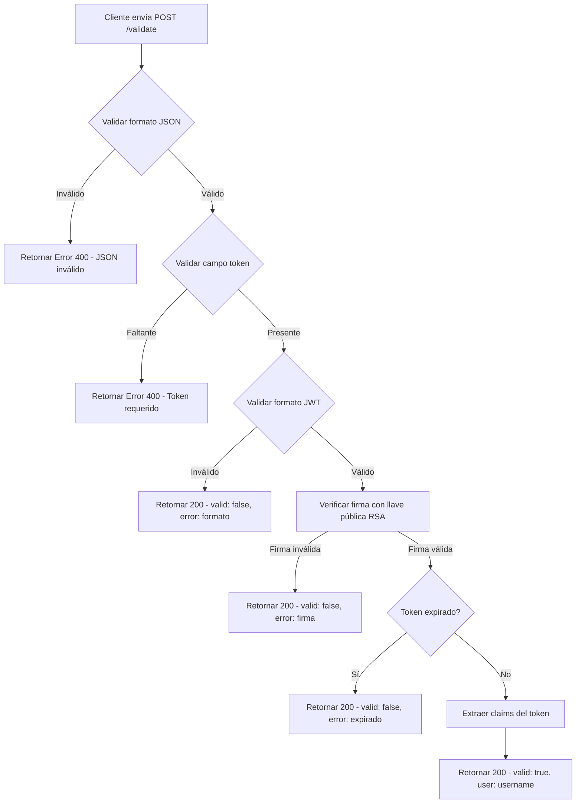

## 3. Flujo de Obtención de Llave Pública

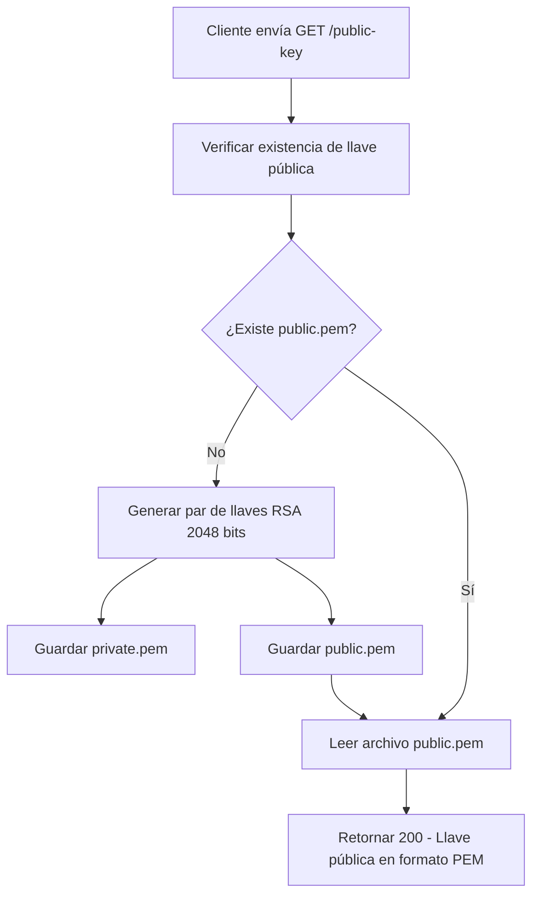

## 4. Flujo de Health Check

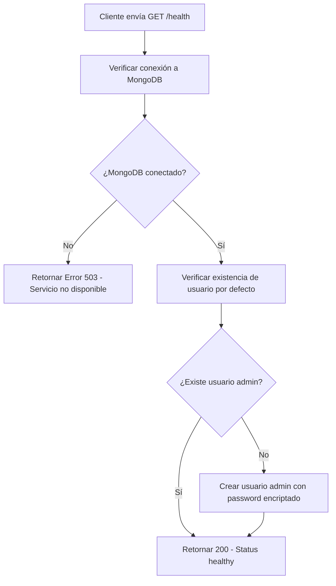

## 5. Flujo de Inicialización del Servicio

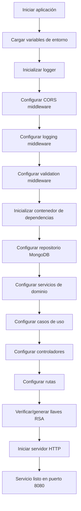

## 6. Flujo de Manejo de Errores

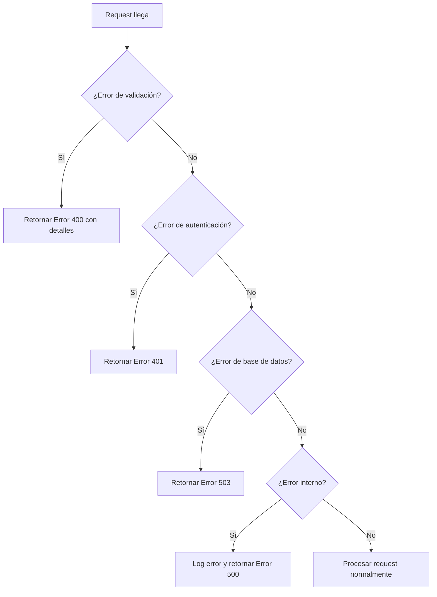

## 7. Flujo de Validación de Datos

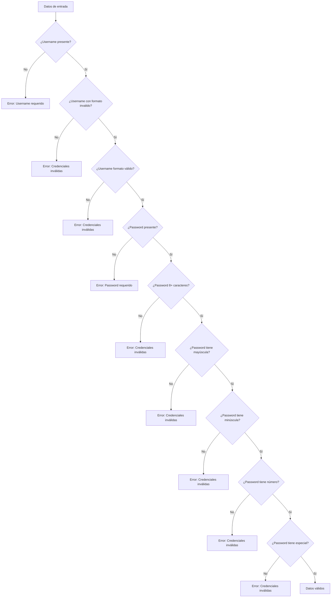

## 8. Flujo de Generación de Token JWT

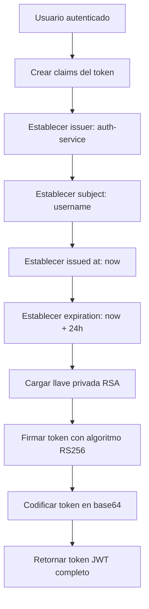

## 9. Flujo de Verificación de Password

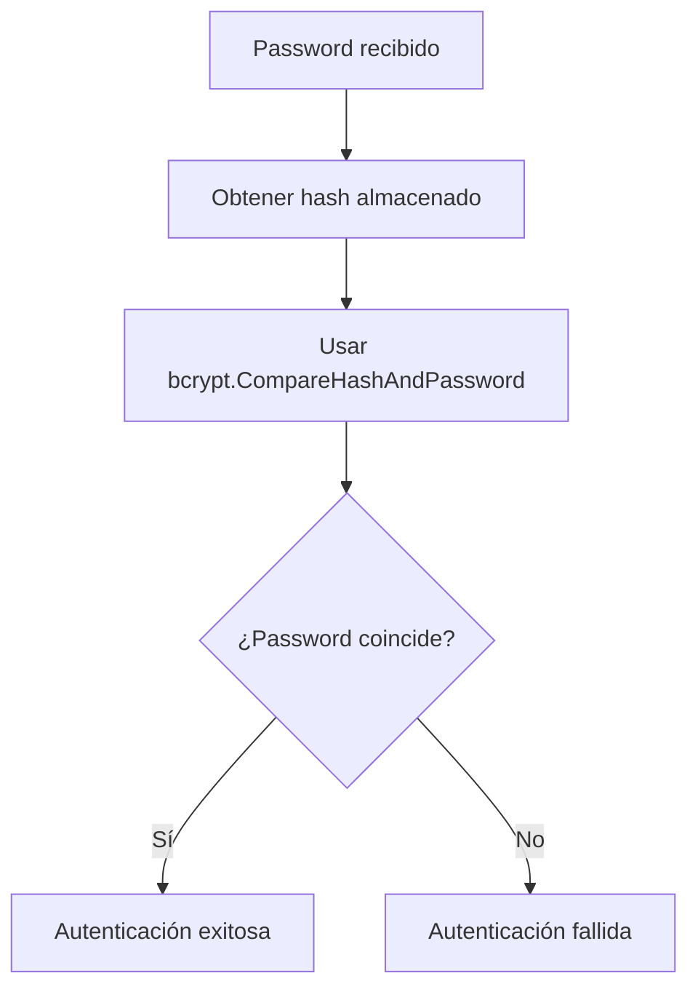

## 10. Flujo de Creación de Usuario por Defecto

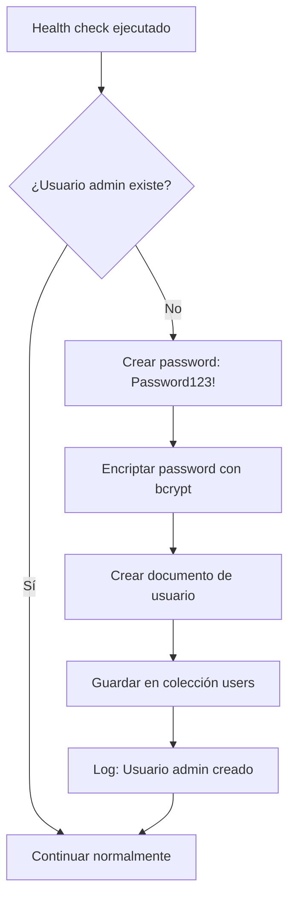

## 11. Flujo de Middleware de CORS

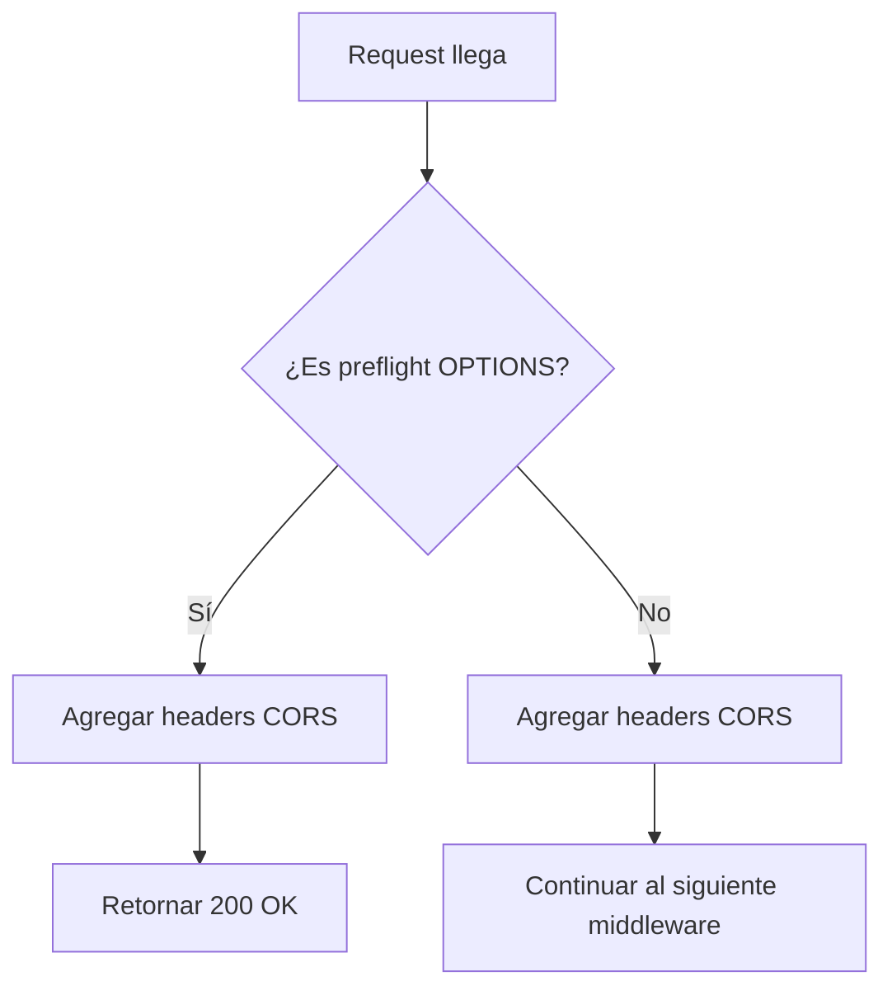

## 12. Flujo de Middleware de Logging

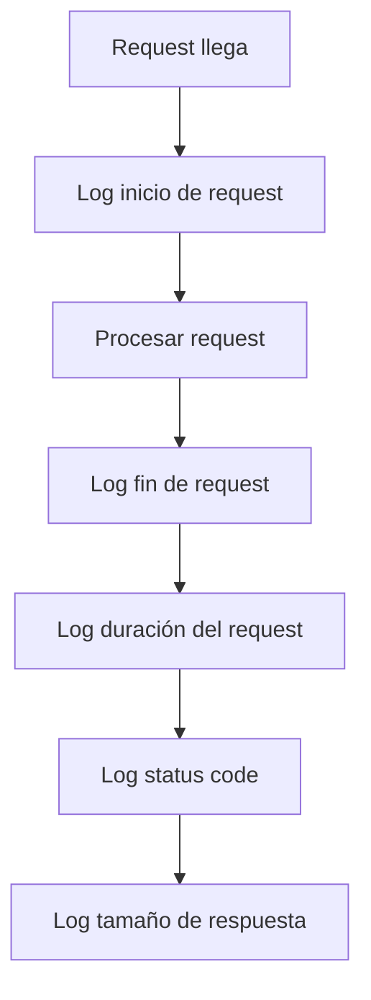

## 13. Flujo de Middleware de Validación

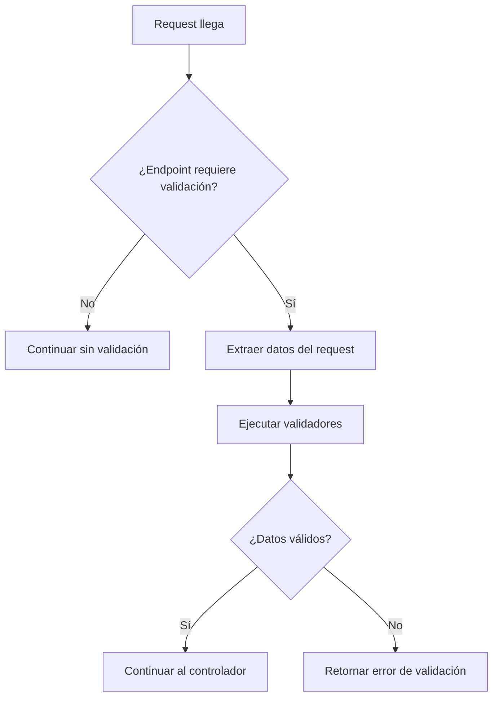

## 14. Flujo de Integración con Otros Servicios

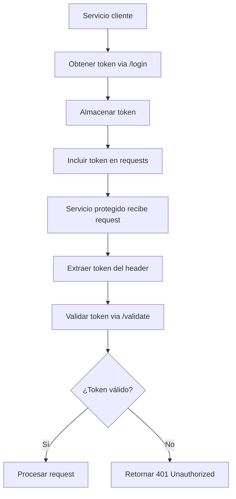

## 15. Flujo de Recuperación de Errores

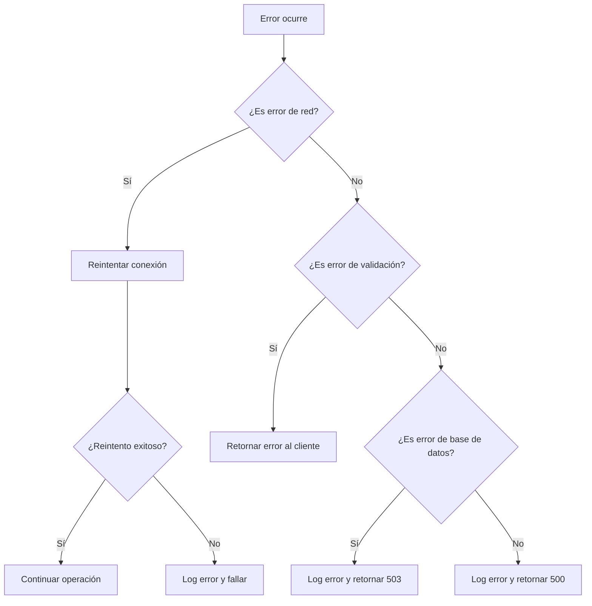