# Diagrama de Secuencia - Auth Service

## 1. Secuencia de Login Exitoso

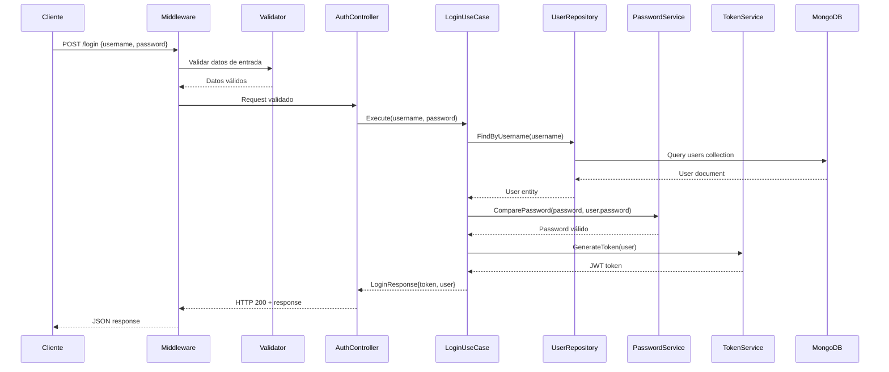

## 2. Secuencia de Login Fallido - Credenciales Inválidas

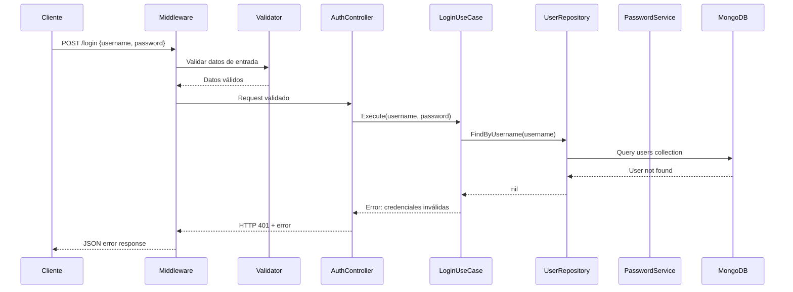

## 3. Secuencia de Login Fallido - Validación

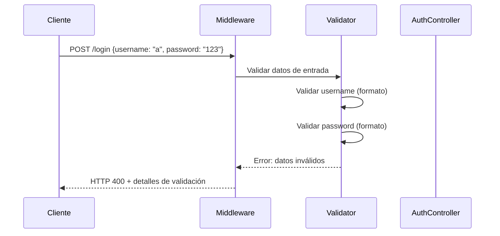

## 4. Secuencia de Validación de Token

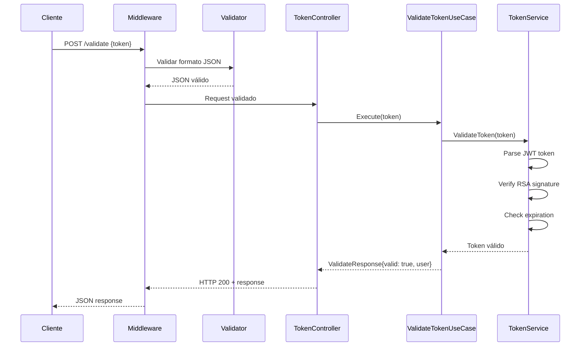

## 5. Secuencia de Validación de Token Expirado

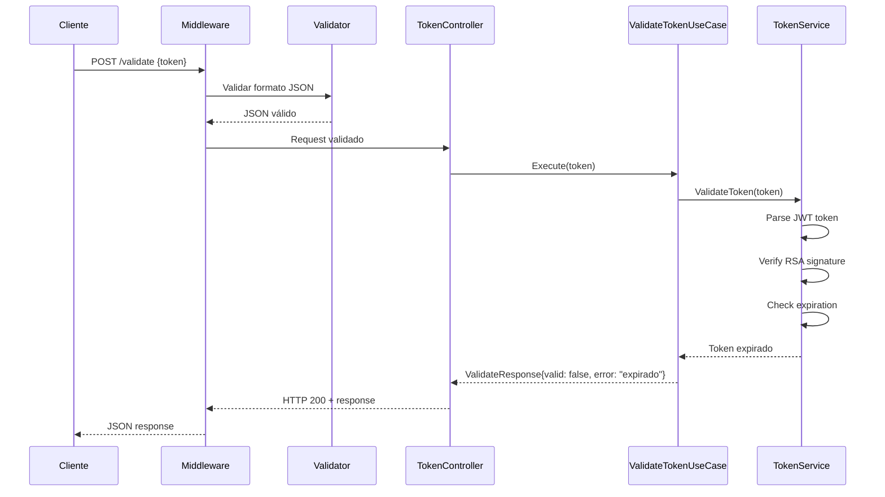

## 6. Secuencia de Obtención de Llave Pública

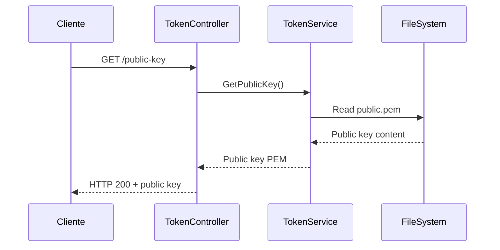

## 7. Secuencia de Health Check

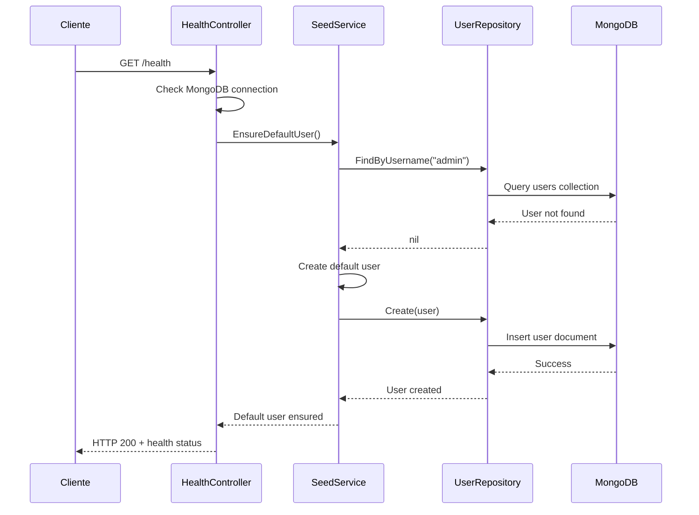

## 8. Secuencia de Inicialización del Servicio

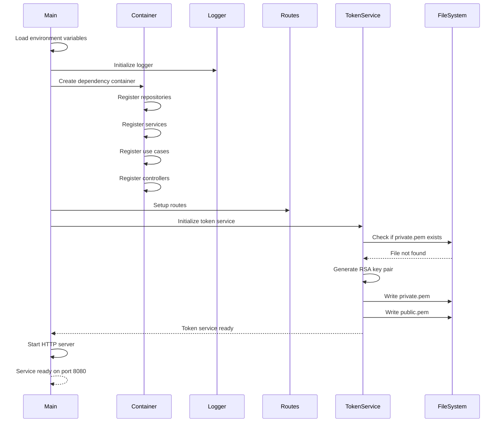

## 9. Secuencia de Error de Validación

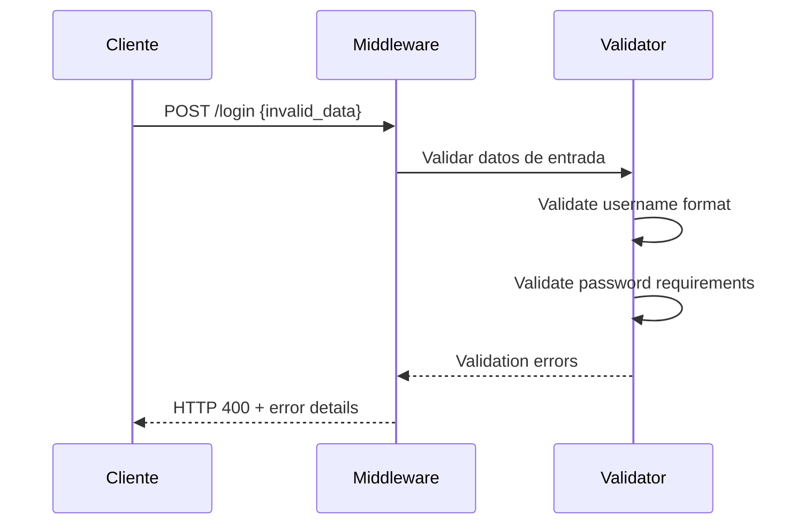

## 10. Secuencia de Error de Base de Datos

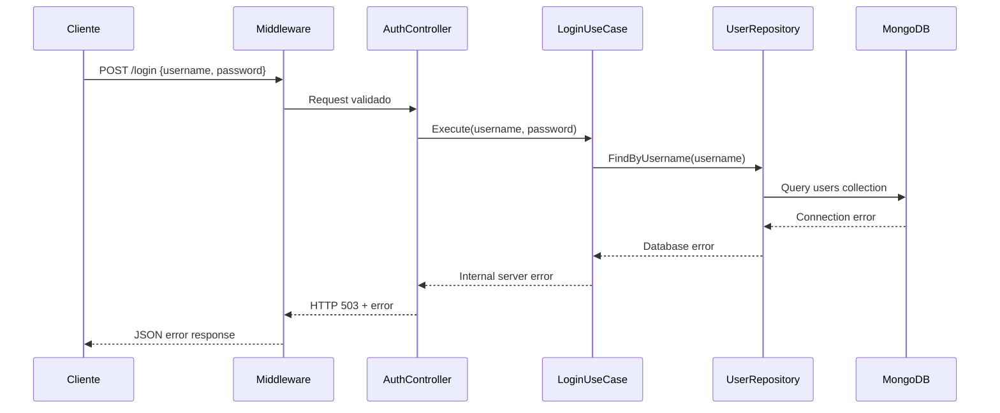

## 11. Secuencia de Middleware de CORS

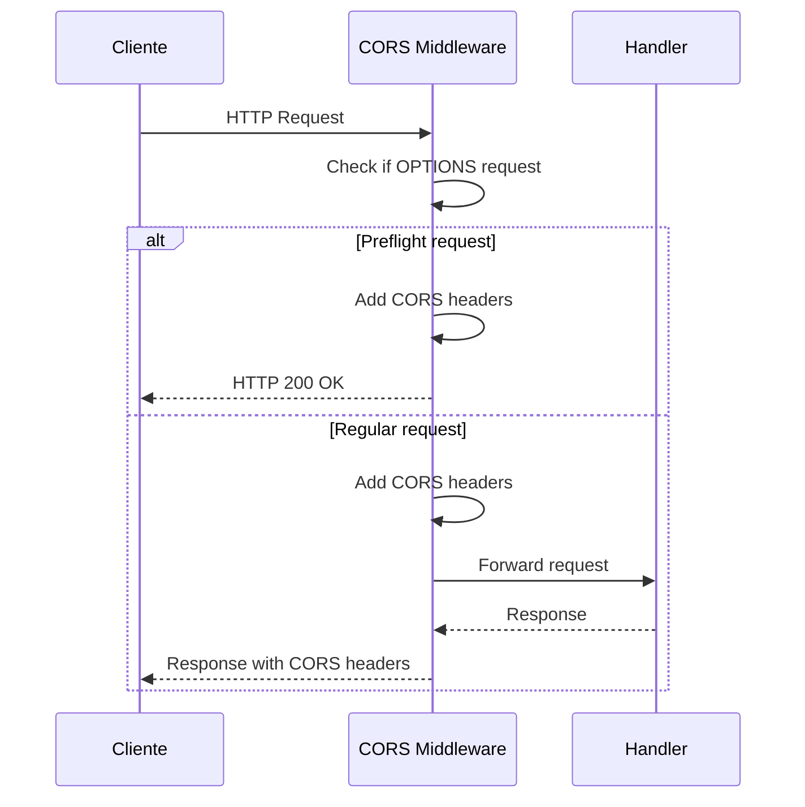

## 12. Secuencia de Middleware de Logging

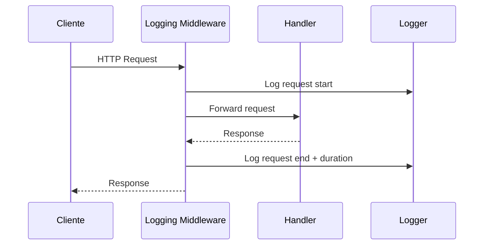

## 13. Secuencia de Integración con Otros Servicios

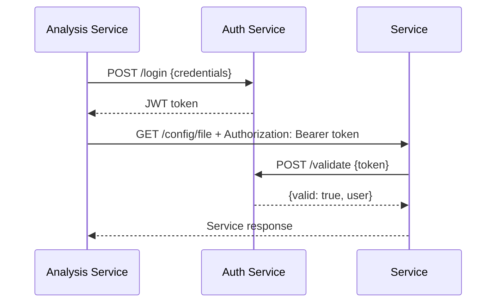

## 14. Secuencia de Creación de Usuario por Defecto

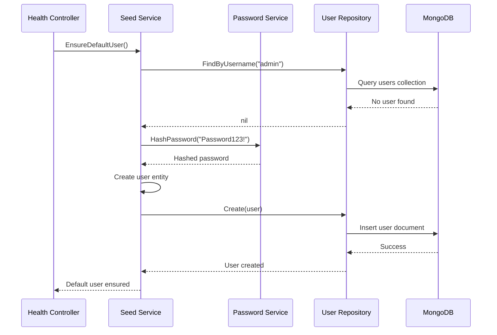

## 15. Secuencia de Manejo de Errores

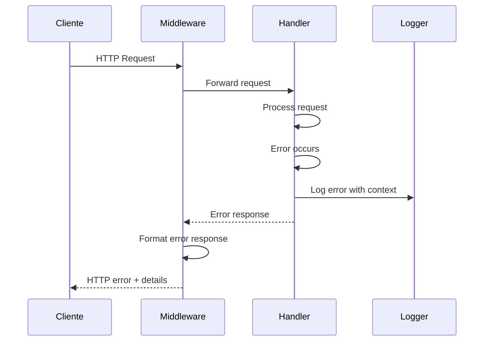