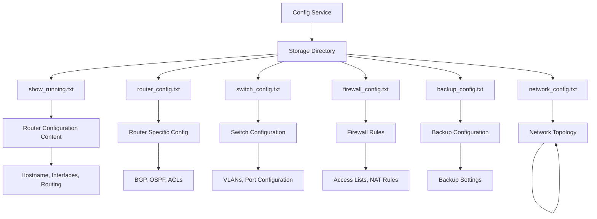
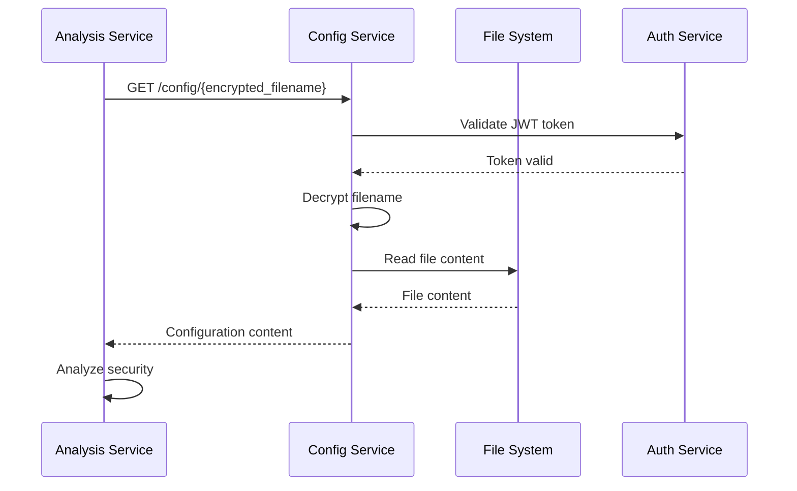

# Diagrama de Base de Datos - Config Service

## Descripción General

El **Config Service** es un servicio de lectura de archivos que **NO utiliza una base de datos tradicional**. En su lugar, utiliza el **sistema de archivos** para almacenar y gestionar archivos de configuración de dispositivos de red. Los archivos se almacenan de forma segura con encriptación AES-256-CBC y se acceden mediante autenticación JWT.

## Estructura de Almacenamiento

### Sistema de Archivos

```
config-service/
└── storage/
    ├── show_running.txt          # Configuración de router (show running-config)
    ├── router_config.txt         # Configuración de router específica
    ├── switch_config.txt         # Configuración de switch
    ├── firewall_config.txt       # Configuración de firewall
    ├── backup_config.txt         # Configuración de respaldo
    └── network_config.txt        # Configuración de red general
```

## Diagrama de Estructura de Archivos



## Estructura de Archivos de Configuración

### 1. show_running.txt
**Descripción:** Configuración actual de un router Cisco
**Formato:** Texto plano con comandos de configuración
**Tamaño típico:** 5-50 KB

```text
# Router Configuration
hostname Router1
!
interface FastEthernet0/0
 ip address 192.168.1.1 255.255.255.0
 no shutdown
!
interface FastEthernet0/1
 ip address 10.0.0.1 255.255.255.0
 no shutdown
!
router ospf 1
 network 192.168.1.0 0.0.0.255 area 0
 network 10.0.0.0 0.0.0.255 area 0
!
end
```

### 2. router_config.txt
**Descripción:** Configuración específica de router con BGP
**Formato:** Texto plano con comandos avanzados
**Tamaño típico:** 10-100 KB

```text
# Router Configuration
hostname Router2
!
interface GigabitEthernet0/0
 ip address 172.16.1.1 255.255.255.0
 no shutdown
!
interface GigabitEthernet0/1
 ip address 172.16.2.1 255.255.255.0
 no shutdown
!
router bgp 65000
 neighbor 172.16.1.2 remote-as 65001
 neighbor 172.16.2.2 remote-as 65002
!
end
```

### 3. switch_config.txt
**Descripción:** Configuración de switch de capa 2/3
**Formato:** Texto plano con configuración de VLANs
**Tamaño típico:** 5-30 KB

```text
# Switch Configuration
hostname Switch1
!
vlan 10
 name DATA
!
vlan 20
 name VOICE
!
interface FastEthernet0/1
 switchport mode access
 switchport access vlan 10
!
interface FastEthernet0/2
 switchport mode access
 switchport access vlan 20
!
end
```

### 4. firewall_config.txt
**Descripción:** Configuración de firewall con reglas de seguridad
**Formato:** Texto plano con ACLs y NAT
**Tamaño típico:** 10-50 KB

```text
# Firewall Configuration
hostname Firewall1
!
interface ethernet0
 nameif outside
 security-level 0
 ip address 203.0.113.1 255.255.255.0
!
interface ethernet1
 nameif inside
 security-level 100
 ip address 192.168.1.1 255.255.255.0
!
access-list OUTSIDE_IN extended permit tcp any host 203.0.113.10 eq www
access-list OUTSIDE_IN extended permit tcp any host 203.0.113.10 eq https
access-list OUTSIDE_IN extended deny ip any any
!
access-group OUTSIDE_IN in interface outside
!
end
```

## Sistema de Encriptación

### Algoritmo AES-256-CBC

El servicio utiliza encriptación AES-256-CBC para proteger los nombres de archivos durante la transmisión.

#### Proceso de Encriptación
```typescript
// Encriptar nombre de archivo
const filename = "show_running.txt";
const encryptedFilename = encrypt(filename, ENCRYPTION_KEY);
// Resultado: "U2FsdGVkX1..."

// Desencriptar nombre de archivo
const decryptedFilename = decrypt(encryptedFilename, ENCRYPTION_KEY);
// Resultado: "show_running.txt"
```

#### Estructura de Datos Encriptados
```
┌─────────────────┬─────────────────┬─────────────────┐
│   IV (16 bytes) │ Ciphertext      │ Base64 Encoding │
│   (Random)      │ (Variable)      │ (Output)        │
└─────────────────┴─────────────────┴─────────────────┘
```

## Gestión de Archivos

### Operaciones de Archivo

#### 1. Lectura de Archivo
```typescript
// Leer archivo de configuración
const content = await fileReaderService.readFile(filename);

// Validar existencia
const exists = await fileReaderService.fileExists(filename);
```

#### 2. Validación de Archivos
- **Existencia**: Verificar que el archivo existe en storage/
- **Permisos**: Verificar permisos de lectura (644)
- **Tamaño**: Validar tamaño máximo permitido (1MB)
- **Formato**: Verificar codificación UTF-8

#### 3. Estructura de Directorios
```
config-service/
├── src/
│   └── storage/              # Directorio de archivos
│       ├── show_running.txt
│       ├── router_config.txt
│       ├── switch_config.txt
│       └── firewall_config.txt
├── storage/                  # Directorio de producción
│   ├── show_running.txt
│   ├── router_config.txt
│   ├── switch_config.txt
│   └── firewall_config.txt
└── backup/                   # Directorio de respaldo
    ├── show_running.txt.bak
    ├── router_config.txt.bak
    ├── switch_config.txt.bak
    └── firewall_config.txt.bak
```

## Metadatos de Archivos

### Información de Archivos

| Archivo | Tamaño | Última Modificación | Tipo | Descripción |
|---------|--------|---------------------|------|-------------|
| `show_running.txt` | 2.5 KB | 2024-01-15 10:30:00 | Router Config | Configuración actual de router |
| `router_config.txt` | 8.1 KB | 2024-01-15 09:15:00 | Router Config | Configuración BGP/OSPF |
| `switch_config.txt` | 3.2 KB | 2024-01-14 16:45:00 | Switch Config | Configuración de VLANs |
| `firewall_config.txt` | 12.8 KB | 2024-01-15 08:20:00 | Firewall Config | Reglas de seguridad |

### Permisos de Archivo
```bash
# Permisos recomendados
-rw-r--r-- 1 config-service config-service 2560 Jan 15 10:30 show_running.txt
-rw-r--r-- 1 config-service config-service 8192 Jan 15 09:15 router_config.txt
-rw-r--r-- 1 config-service config-service 3276 Jan 14 16:45 switch_config.txt
-rw-r--r-- 1 config-service config-service 12800 Jan 15 08:20 firewall_config.txt
```

## Seguridad de Archivos

### Medidas de Seguridad Implementadas

#### 1. Encriptación de Nombres
- **Algoritmo**: AES-256-CBC
- **IV**: Generado aleatoriamente para cada encriptación
- **Codificación**: Base64 para transmisión HTTP

#### 2. Autenticación JWT
- **Validación**: Cada request requiere token JWT válido
- **Integración**: Comunicación con Auth Service
- **Expiración**: Tokens con tiempo de vida limitado

#### 3. Validación de Entrada
- **Nombres de archivo**: Validación de caracteres permitidos
- **Tamaño**: Límite de tamaño de archivo
- **Formato**: Validación de codificación UTF-8

#### 4. Control de Acceso
- **Permisos**: Solo lectura para el servicio
- **Directorio**: Acceso restringido a storage/
- **Logs**: Registro de todas las operaciones

## Backup y Recuperación

### Estrategia de Backup

#### 1. Backup Automático
```bash
#!/bin/bash
# backup_config_files.sh

BACKUP_DIR="/backup/config_files"
STORAGE_DIR="/app/storage"
DATE=$(date +%Y%m%d_%H%M%S)

# Crear directorio de backup
mkdir -p $BACKUP_DIR

# Copiar archivos de configuración
cp $STORAGE_DIR/*.txt $BACKUP_DIR/

# Comprimir backup
tar -czf $BACKUP_DIR/config_backup_$DATE.tar.gz -C $BACKUP_DIR *.txt

# Limpiar archivos temporales
rm $BACKUP_DIR/*.txt

echo "Backup completado: config_backup_$DATE.tar.gz"
```

#### 2. Restauración
```bash
#!/bin/bash
# restore_config_files.sh

BACKUP_FILE=$1
STORAGE_DIR="/app/storage"

# Verificar archivo de backup
if [ ! -f "$BACKUP_FILE" ]; then
    echo "Error: Archivo de backup no encontrado"
    exit 1
fi

# Restaurar archivos
tar -xzf $BACKUP_FILE -C $STORAGE_DIR

echo "Restauración completada"
```

## Monitoreo de Archivos

### Métricas de Archivos

#### 1. Estadísticas de Uso
```bash
# Tamaño total de archivos
du -sh /app/storage/

# Número de archivos
ls -1 /app/storage/*.txt | wc -l

# Archivos más recientes
ls -lt /app/storage/*.txt | head -5
```

#### 2. Verificación de Integridad
```bash
# Calcular checksums
md5sum /app/storage/*.txt > checksums.txt

# Verificar integridad
md5sum -c checksums.txt
```

#### 3. Logs de Acceso
```json
{
  "timestamp": "2024-01-15T10:30:00Z",
  "service": "config-service",
  "action": "read_file",
  "filename": "show_running.txt",
  "user": "admin",
  "ip": "192.168.1.100",
  "status": "success",
  "file_size": 2560
}
```

## Integración con Analysis Service

### Flujo de Datos



### Formato de Respuesta
```json
{
  "message": "Archivo leído exitosamente",
  "data": {
    "message": "Archivo leído exitosamente",
    "content": "# Router Configuration\nhostname Router1\n!..."
  }
}
```

## Troubleshooting

### Problemas Comunes

#### 1. Archivo No Encontrado
```
Error: ENOENT: no such file or directory
```
**Solución:** Verificar que el archivo existe en storage/

#### 2. Error de Permisos
```
Error: EACCES: permission denied
```
**Solución:** Verificar permisos de lectura en storage/

#### 3. Error de Encriptación
```
Error: Invalid key length
```
**Solución:** Verificar que ENCRYPTION_KEY tenga la longitud correcta

#### 4. Error de Codificación
```
Error: Invalid UTF-8 sequence
```
**Solución:** Verificar que el archivo esté en UTF-8

### Comandos de Diagnóstico
```bash
# Verificar archivos disponibles
ls -la /app/storage/

# Verificar permisos
stat /app/storage/show_running.txt

# Verificar contenido
head -10 /app/storage/show_running.txt

# Verificar codificación
file -i /app/storage/show_running.txt
```

## Consideraciones de Escalabilidad

### 1. Almacenamiento Distribuido
- **NFS**: Montar storage/ en servidor NFS
- **S3**: Migrar a Amazon S3 para archivos
- **CDN**: Usar CDN para archivos grandes

### 2. Caché de Archivos
- **Redis**: Cachear contenido de archivos frecuentes
- **Memoria**: Cachear en memoria del servicio
- **TTL**: Configurar tiempo de vida del caché

### 3. Compresión
- **Gzip**: Comprimir archivos grandes
- **LZ4**: Compresión rápida para archivos medianos
- **Brotli**: Compresión eficiente para HTTP

## Migración de Datos

### 1. Agregar Nuevos Archivos
```bash
# Copiar nuevo archivo
cp new_config.txt /app/storage/

# Verificar permisos
chmod 644 /app/storage/new_config.txt

# Verificar contenido
cat /app/storage/new_config.txt
```

### 2. Actualizar Archivos Existentes
```bash
# Crear backup
cp /app/storage/show_running.txt /backup/show_running.txt.bak

# Actualizar archivo
cp updated_config.txt /app/storage/show_running.txt

# Verificar cambios
diff /backup/show_running.txt.bak /app/storage/show_running.txt
```

### 3. Eliminar Archivos
```bash
# Crear backup antes de eliminar
cp /app/storage/old_config.txt /backup/old_config.txt.bak

# Eliminar archivo
rm /app/storage/old_config.txt

# Verificar eliminación
ls -la /app/storage/old_config.txt
``` 