# Diagrama de Flujo - Config Service

## 1. Flujo Principal de Lectura de Configuración

```mermaid
flowchart TD
    A[Cliente envía GET /config/{filename}] --> B{¿Header Authorization presente?}
    B -->|No| C[Retornar Error 401 - Token requerido]
    B -->|Sí| D[Extraer token del header]
    D --> E{¿Formato de token válido?}
    E -->|No| F[Retornar Error 401 - Formato inválido]
    E -->|Sí| G[Validar token con Auth Service]
    G --> H{¿Token válido?}
    H -->|No| I[Retornar Error 401 - Token inválido]
    H -->|Sí| J[Desencriptar nombre de archivo]
    J --> K{¿Desencriptación exitosa?}
    K -->|No| L[Retornar Error 400 - Nombre inválido]
    K -->|Sí| M[Verificar existencia de archivo]
    M --> N{¿Archivo existe?}
    N -->|No| O[Retornar Error 404 - Archivo no encontrado]
    N -->|Sí| P[Leer contenido del archivo]
    P --> Q{¿Lectura exitosa?}
    Q -->|No| R[Retornar Error 500 - Error de lectura]
    Q -->|Sí| S[Retornar 200 - Contenido del archivo]
```

## 2. Flujo de Health Check

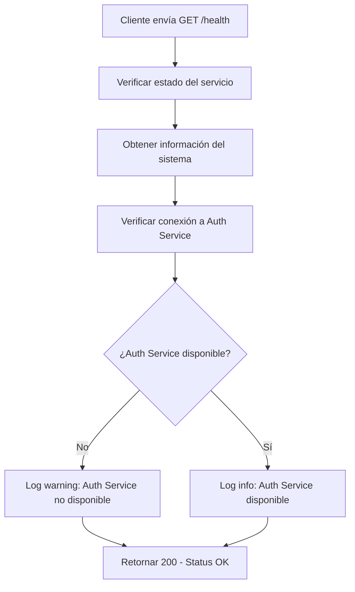

## 3. Flujo de Middleware de Autenticación

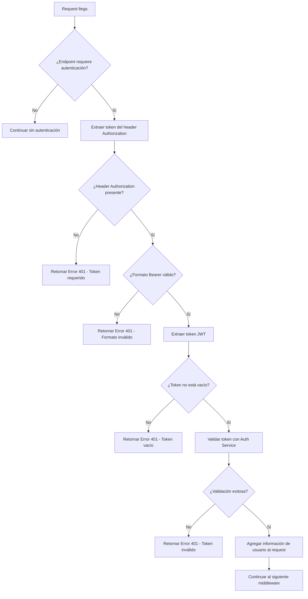

## 4. Flujo de Desencriptación de Nombre de Archivo

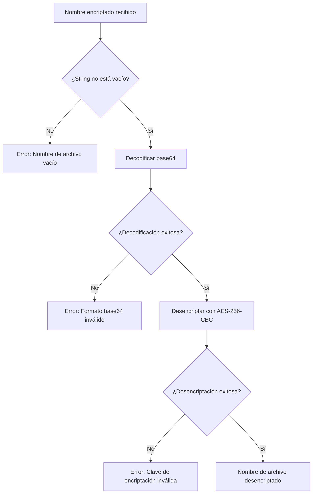

## 5. Flujo de Lectura de Archivo

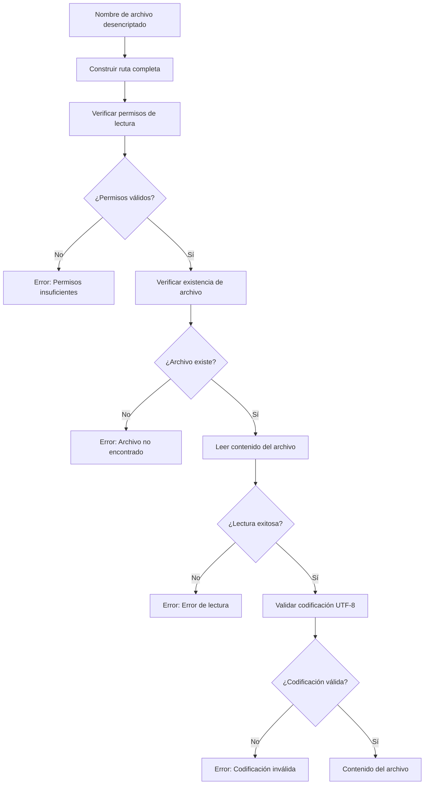

## 6. Flujo de Manejo de Errores

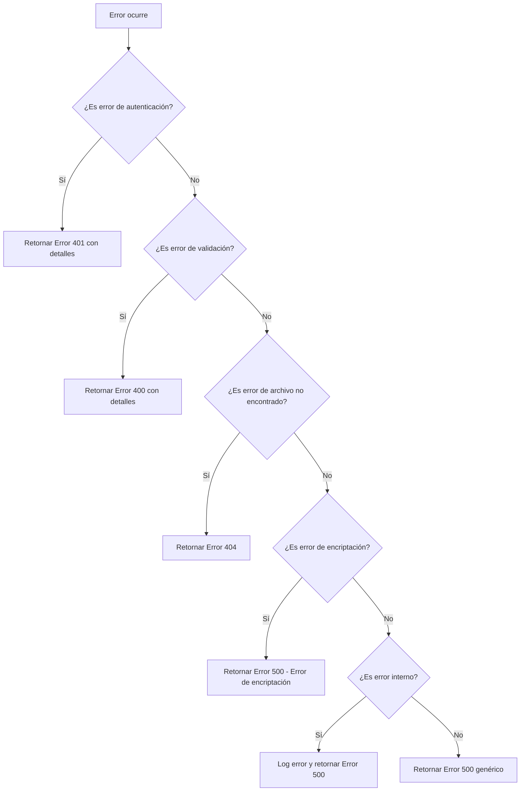

## 7. Flujo de Inicialización del Servicio

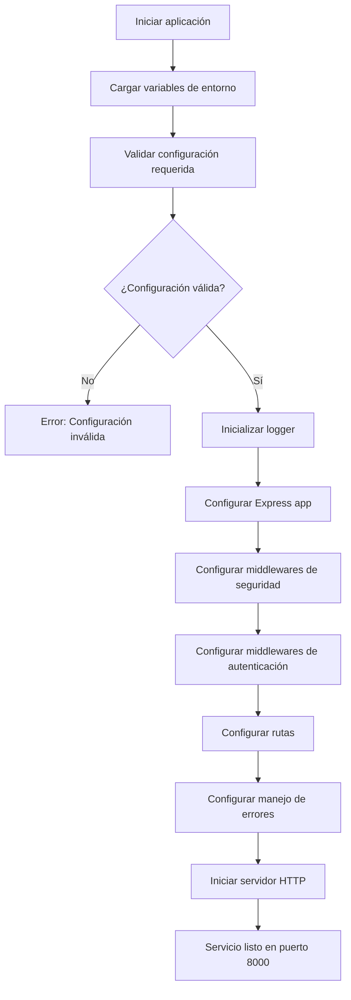

## 8. Flujo de Validación de Token con Auth Service

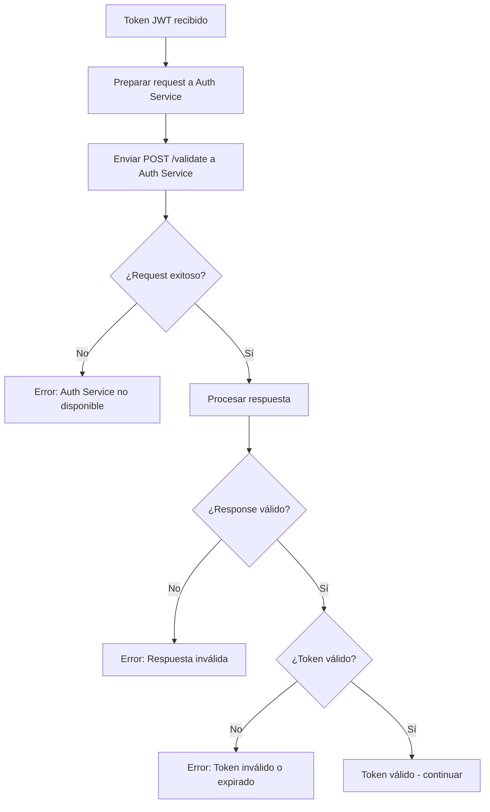

## 9. Flujo de Middleware de Seguridad (Helmet)

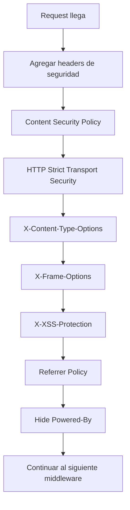

## 10. Flujo de Logging

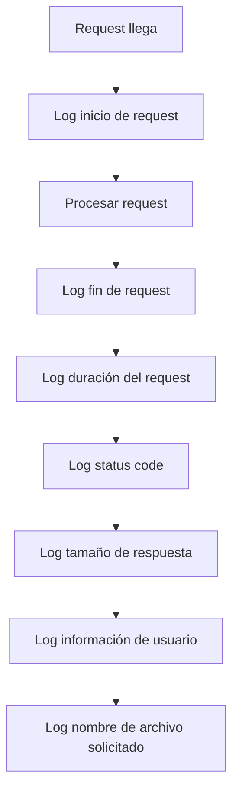

## 11. Flujo de Encriptación (Utilidad)

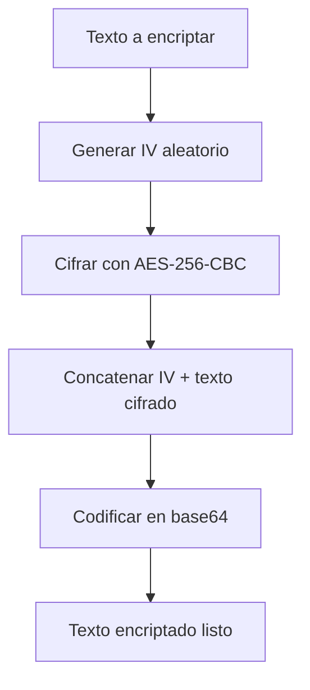

## 12. Flujo de Desencriptación (Utilidad)

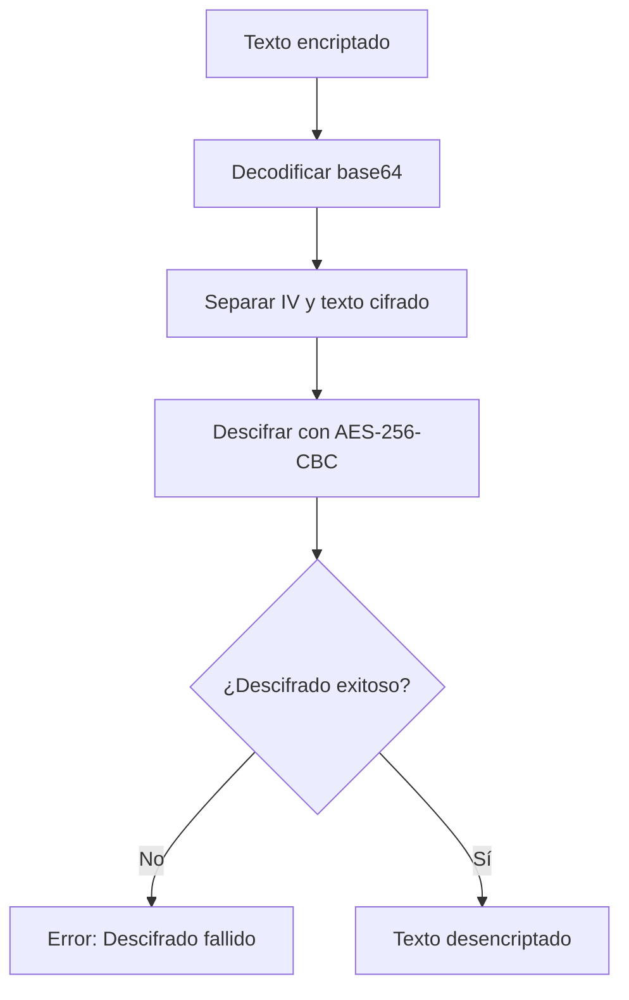

## 13. Flujo de Validación de Configuración

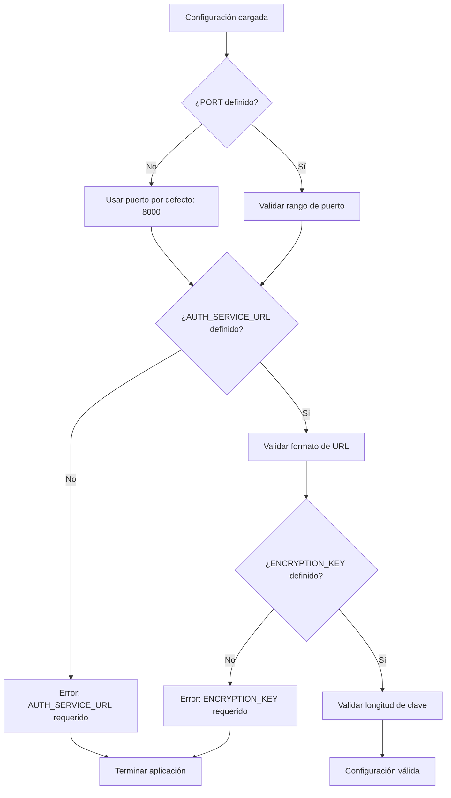

## 14. Flujo de Manejo de Archivos de Configuración

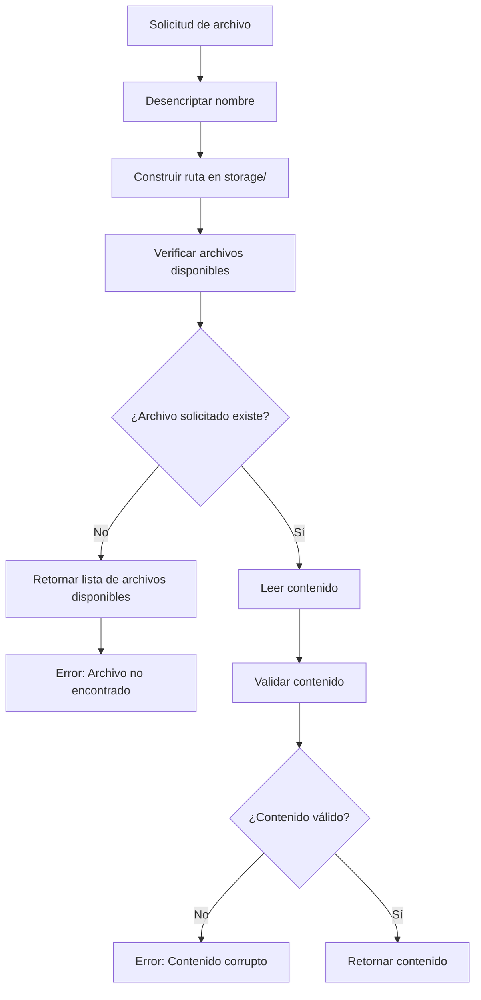

## 15. Flujo de Integración con Analysis Service

```mermaid
flowchart TD
    A[Analysis Service solicita archivo] --> B[Enviar GET /config/{filename}]
    B --> C[Validar token JWT]
    C --> D{¿Token válido?}
    D -->|No| E[Retornar Error 401]
    D -->|Sí| F[Leer archivo de configuración]
    E --> G[Analysis Service maneja error]
    F --> H{¿Lectura exitosa?}
    H -->|No| I[Retornar Error 500]
    H -->|Sí| J[Retornar contenido del archivo]
    I --> G
    J --> K[Analysis Service procesa configuración]
``` 