# Diagrama de Secuencia - Config Service

## 1. Secuencia de Lectura de Configuración Exitosa

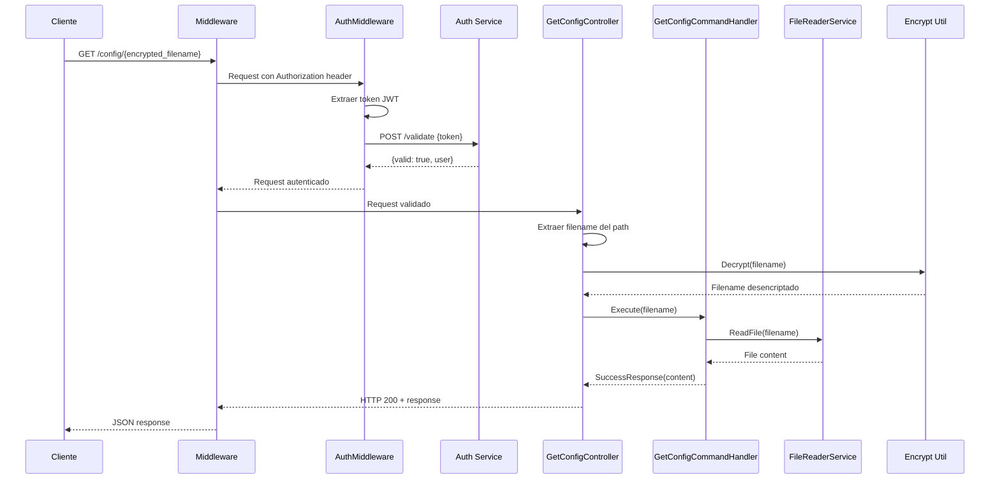
```mermaid
sequenceDiagram
    participant C as Cliente
    participant M as Middleware
    participant A as AuthMiddleware
    participant AS as Auth Service
    participant G as GetConfigController
    participant H as GetConfigCommandHandler
    participant F as FileReaderService
    participant E as Encrypt Util

    C->>M: GET /config/{encrypted_filename}
    M->>A: Request con Authorization header
    A->>A: Extraer token JWT
    A->>AS: POST /validate {token}
    AS-->>A: {valid: true, user}
    A-->>M: Request autenticado
    M->>G: Request validado
    G->>G: Extraer filename del path
    G->>E: Decrypt(filename)
    E-->>G: Filename desencriptado
    G->>H: Execute(filename)
    H->>F: ReadFile(filename)
    F-->>H: File content
    H-->>G: SuccessResponse(content)
    G-->>M: HTTP 200 + response
    M-->>C: JSON response
```

## 2. Secuencia de Lectura de Configuración - Token Inválido

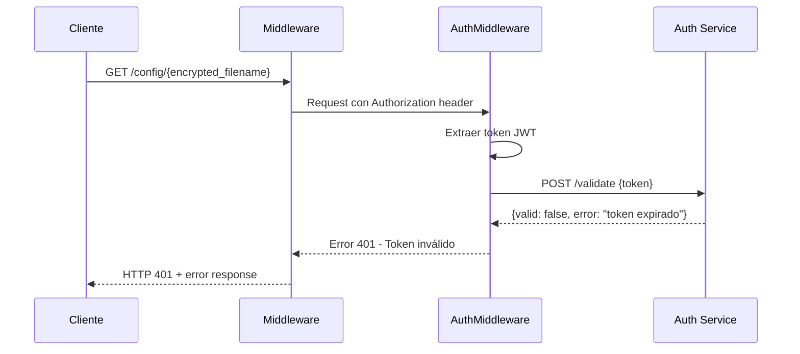
```mermaid
sequenceDiagram
    participant C as Cliente
    participant M as Middleware
    participant A as AuthMiddleware
    participant AS as Auth Service

    C->>M: GET /config/{encrypted_filename}
    M->>A: Request con Authorization header
    A->>A: Extraer token JWT
    A->>AS: POST /validate {token}
    AS-->>A: {valid: false, error: "token expirado"}
    A-->>M: Error 401 - Token inválido
    M-->>C: HTTP 401 + error response
```

## 3. Secuencia de Lectura de Configuración - Token Faltante

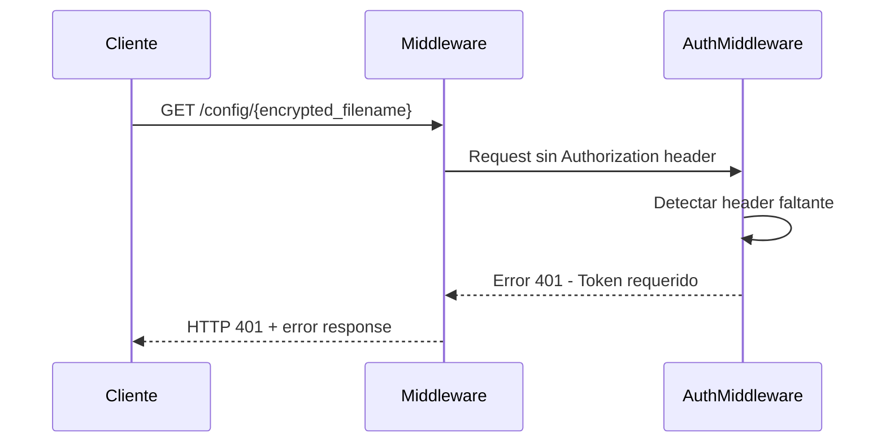
```mermaid
sequenceDiagram
    participant C as Cliente
    participant M as Middleware
    participant A as AuthMiddleware

    C->>M: GET /config/{encrypted_filename}
    M->>A: Request sin Authorization header
    A->>A: Detectar header faltante
    A-->>M: Error 401 - Token requerido
    M-->>C: HTTP 401 + error response
```

## 4. Secuencia de Lectura de Configuración - Archivo No Encontrado

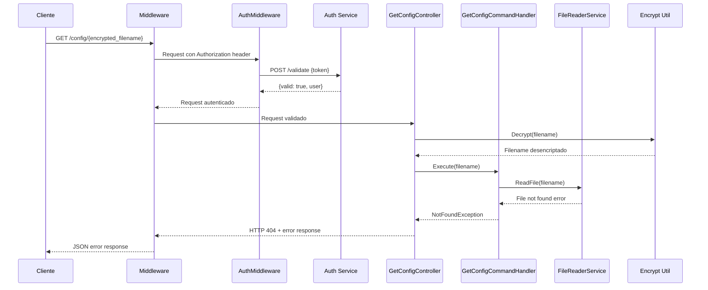
```mermaid
sequenceDiagram
    participant C as Cliente
    participant M as Middleware
    participant A as AuthMiddleware
    participant AS as Auth Service
    participant G as GetConfigController
    participant H as GetConfigCommandHandler
    participant F as FileReaderService
    participant E as Encrypt Util

    C->>M: GET /config/{encrypted_filename}
    M->>A: Request con Authorization header
    A->>AS: POST /validate {token}
    AS-->>A: {valid: true, user}
    A-->>M: Request autenticado
    M->>G: Request validado
    G->>E: Decrypt(filename)
    E-->>G: Filename desencriptado
    G->>H: Execute(filename)
    H->>F: ReadFile(filename)
    F-->>H: File not found error
    H-->>G: NotFoundException
    G-->>M: HTTP 404 + error response
    M-->>C: JSON error response
```

## 5. Secuencia de Health Check

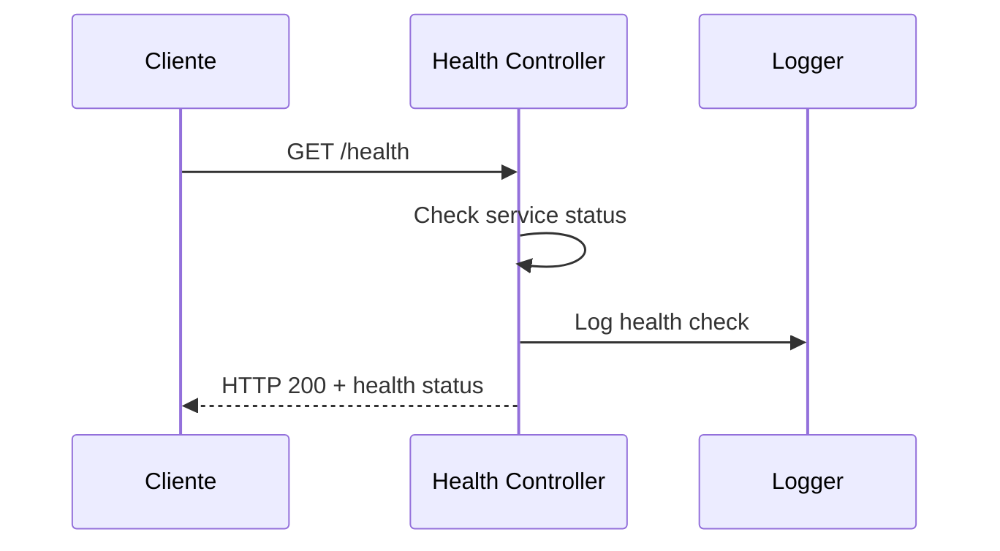
```mermaid
sequenceDiagram
    participant C as Cliente
    participant H as Health Controller
    participant L as Logger

    C->>H: GET /health
    H->>H: Check service status
    H->>L: Log health check
    H-->>C: HTTP 200 + health status
```

## 6. Secuencia de Inicialización del Servicio

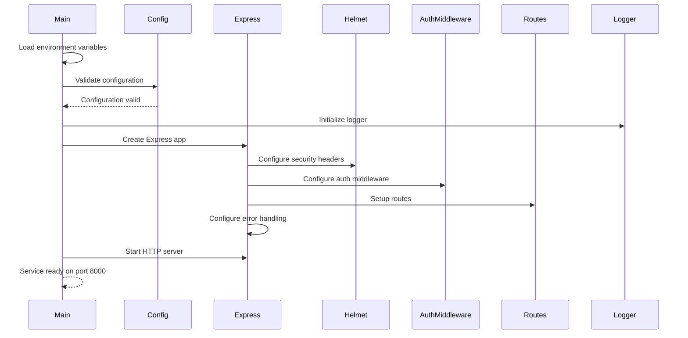
```mermaid
sequenceDiagram
    participant M as Main
    participant C as Config
    participant E as Express
    participant H as Helmet
    participant A as AuthMiddleware
    participant R as Routes
    participant L as Logger

    M->>M: Load environment variables
    M->>C: Validate configuration
    C-->>M: Configuration valid
    M->>L: Initialize logger
    M->>E: Create Express app
    E->>H: Configure security headers
    E->>A: Configure auth middleware
    E->>R: Setup routes
    E->>E: Configure error handling
    M->>E: Start HTTP server
    M-->>M: Service ready on port 8000
```

## 7. Secuencia de Middleware de Autenticación

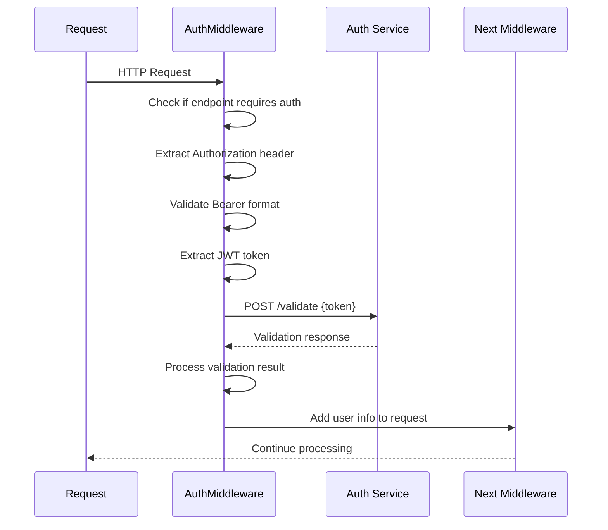
```mermaid
sequenceDiagram
    participant R as Request
    participant A as AuthMiddleware
    participant AS as Auth Service
    participant N as Next Middleware

    R->>A: HTTP Request
    A->>A: Check if endpoint requires auth
    A->>A: Extract Authorization header
    A->>A: Validate Bearer format
    A->>A: Extract JWT token
    A->>AS: POST /validate {token}
    AS-->>A: Validation response
    A->>A: Process validation result
    A->>N: Add user info to request
    N-->>R: Continue processing
```

## 8. Secuencia de Desencriptación de Nombre de Archivo

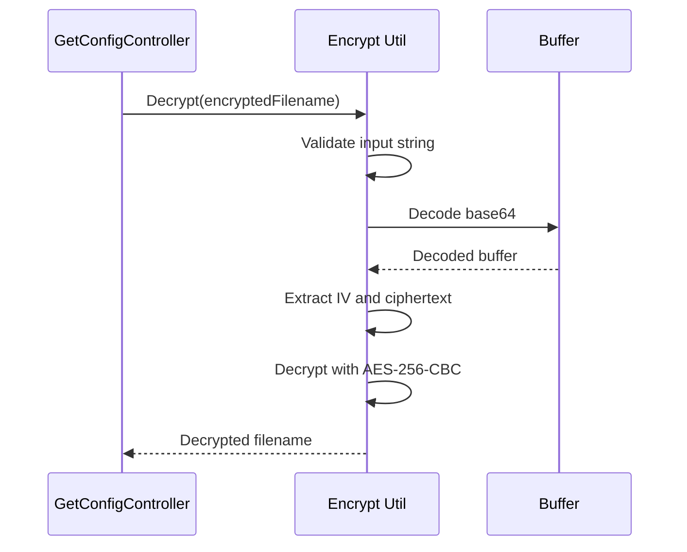
```mermaid
sequenceDiagram
    participant G as GetConfigController
    participant E as Encrypt Util
    participant B as Buffer

    G->>E: Decrypt(encryptedFilename)
    E->>E: Validate input string
    E->>B: Decode base64
    B-->>E: Decoded buffer
    E->>E: Extract IV and ciphertext
    E->>E: Decrypt with AES-256-CBC
    E-->>G: Decrypted filename
```

## 9. Secuencia de Lectura de Archivo

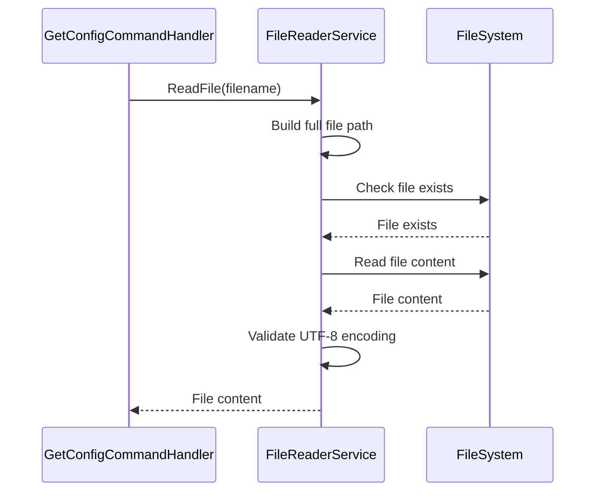
```mermaid
sequenceDiagram
    participant H as GetConfigCommandHandler
    participant F as FileReaderService
    participant FS as FileSystem

    H->>F: ReadFile(filename)
    F->>F: Build full file path
    F->>FS: Check file exists
    FS-->>F: File exists
    F->>FS: Read file content
    FS-->>F: File content
    F->>F: Validate UTF-8 encoding
    F-->>H: File content
```

## 10. Secuencia de Error de Archivo No Encontrado

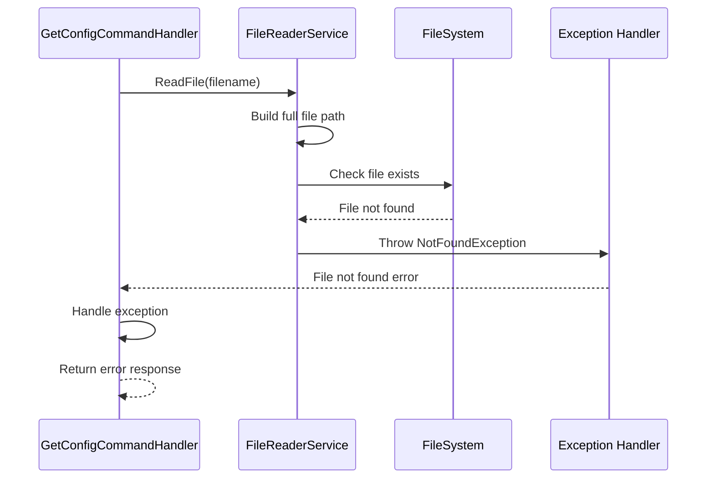
```mermaid
sequenceDiagram
    participant H as GetConfigCommandHandler
    participant F as FileReaderService
    participant FS as FileSystem
    participant E as Exception Handler

    H->>F: ReadFile(filename)
    F->>F: Build full file path
    F->>FS: Check file exists
    FS-->>F: File not found
    F->>E: Throw NotFoundException
    E-->>H: File not found error
    H->>H: Handle exception
    H-->>H: Return error response
```

## 11. Secuencia de Error de Encriptación

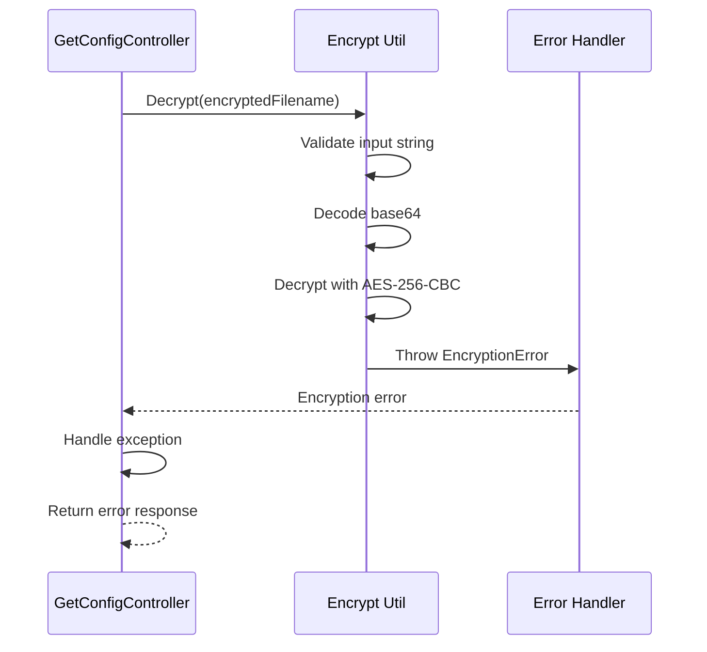
```mermaid
sequenceDiagram
    participant G as GetConfigController
    participant E as Encrypt Util
    participant EH as Error Handler

    G->>E: Decrypt(encryptedFilename)
    E->>E: Validate input string
    E->>E: Decode base64
    E->>E: Decrypt with AES-256-CBC
    E->>EH: Throw EncryptionError
    EH-->>G: Encryption error
    G->>G: Handle exception
    G-->>G: Return error response
```

## 12. Secuencia de Middleware de Seguridad (Helmet)

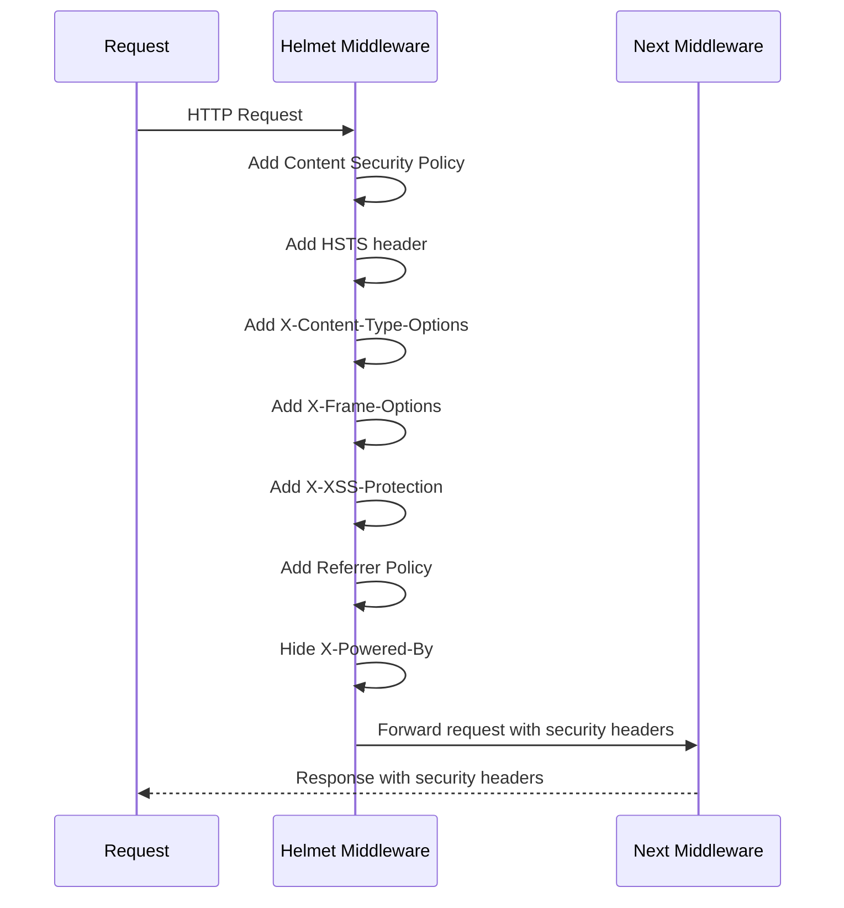
```mermaid
sequenceDiagram
    participant R as Request
    participant H as Helmet Middleware
    participant N as Next Middleware

    R->>H: HTTP Request
    H->>H: Add Content Security Policy
    H->>H: Add HSTS header
    H->>H: Add X-Content-Type-Options
    H->>H: Add X-Frame-Options
    H->>H: Add X-XSS-Protection
    H->>H: Add Referrer Policy
    H->>H: Hide X-Powered-By
    H->>N: Forward request with security headers
    N-->>R: Response with security headers
```

## 13. Secuencia de Logging

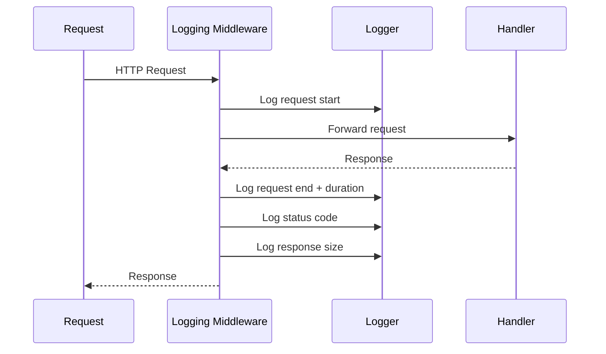
```mermaid
sequenceDiagram
    participant R as Request
    participant L as Logging Middleware
    participant LG as Logger
    participant H as Handler

    R->>L: HTTP Request
    L->>LG: Log request start
    L->>H: Forward request
    H-->>L: Response
    L->>LG: Log request end + duration
    L->>LG: Log status code
    L->>LG: Log response size
    L-->>R: Response
```

## 14. Secuencia de Integración con Analysis Service

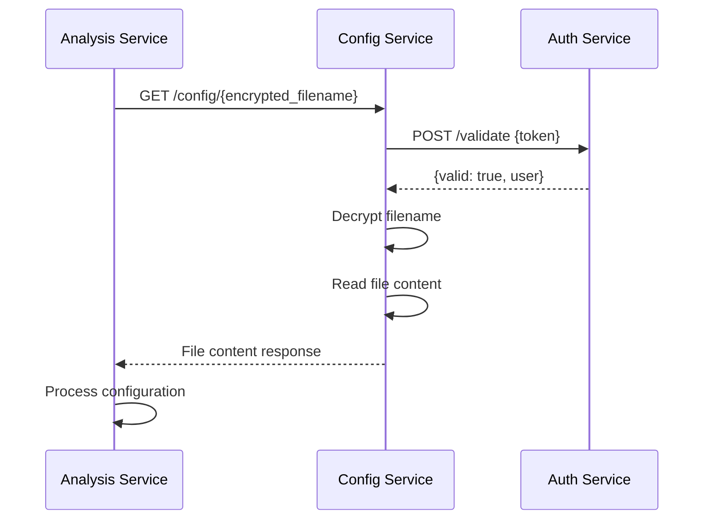
```mermaid
sequenceDiagram
    participant AS as Analysis Service
    participant C as Config Service
    participant A as Auth Service

    AS->>C: GET /config/{encrypted_filename}
    C->>A: POST /validate {token}
    A-->>C: {valid: true, user}
    C->>C: Decrypt filename
    C->>C: Read file content
    C-->>AS: File content response
    AS->>AS: Process configuration
```

## 15. Secuencia de Manejo de Errores

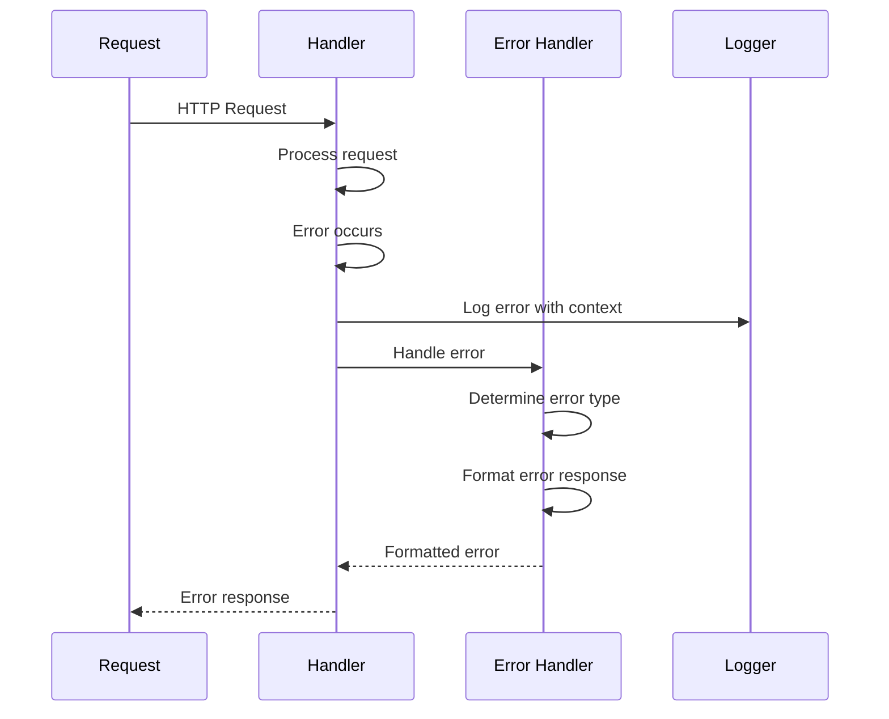
```mermaid
sequenceDiagram
    participant R as Request
    participant H as Handler
    participant E as Error Handler
    participant L as Logger

    R->>H: HTTP Request
    H->>H: Process request
    H->>H: Error occurs
    H->>L: Log error with context
    H->>E: Handle error
    E->>E: Determine error type
    E->>E: Format error response
    E-->>H: Formatted error
    H-->>R: Error response
```

## 16. Secuencia de Validación de Configuración

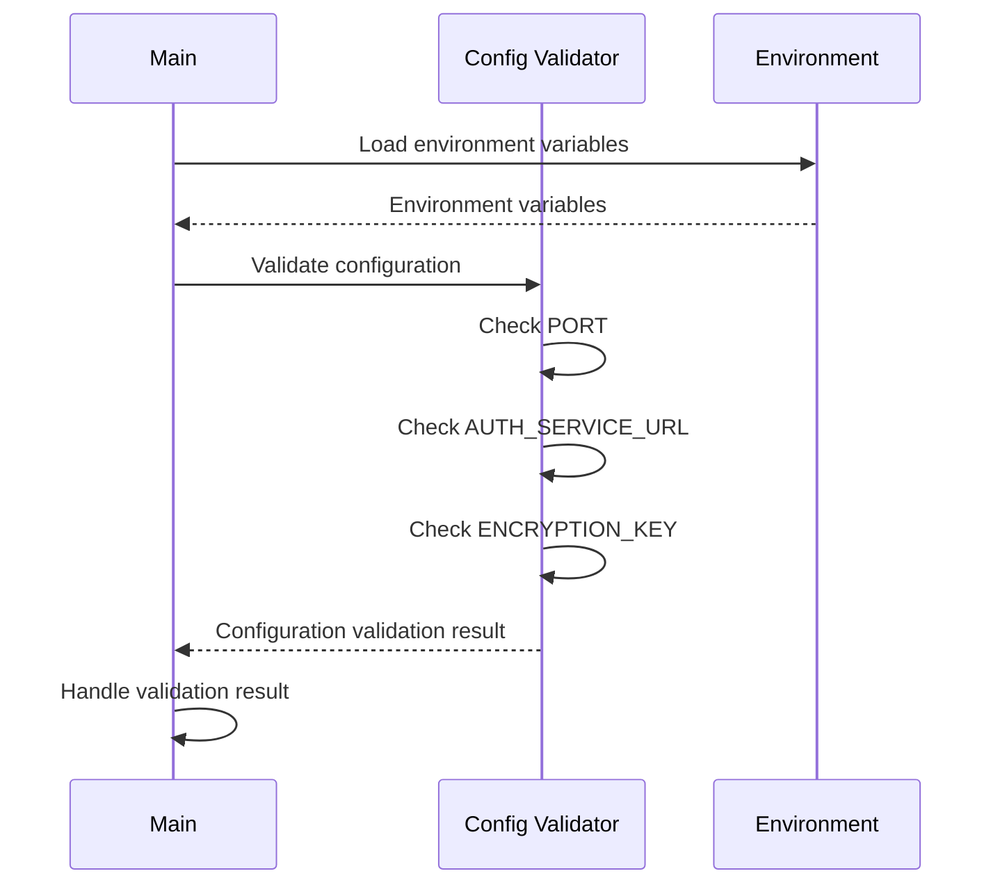
```mermaid
sequenceDiagram
    participant M as Main
    participant C as Config Validator
    participant E as Environment

    M->>E: Load environment variables
    E-->>M: Environment variables
    M->>C: Validate configuration
    C->>C: Check PORT
    C->>C: Check AUTH_SERVICE_URL
    C->>C: Check ENCRYPTION_KEY
    C-->>M: Configuration validation result
    M->>M: Handle validation result
```

## 17. Secuencia de Utilidad de Encriptación

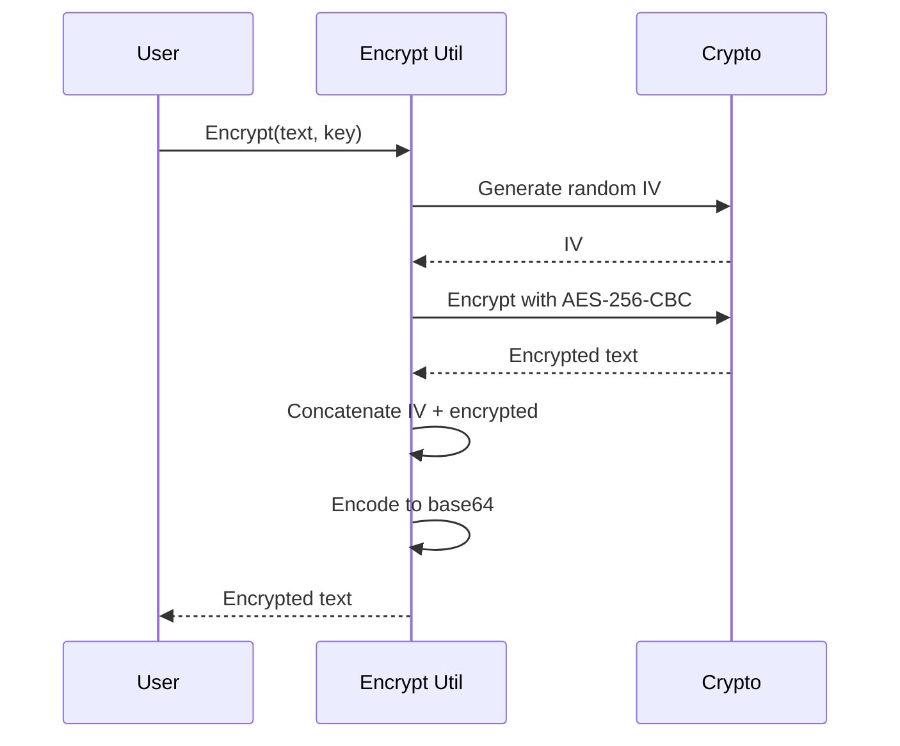
```mermaid
sequenceDiagram
    participant U as User
    participant E as Encrypt Util
    participant C as Crypto

    U->>E: Encrypt(text, key)
    E->>C: Generate random IV
    C-->>E: IV
    E->>C: Encrypt with AES-256-CBC
    C-->>E: Encrypted text
    E->>E: Concatenate IV + encrypted
    E->>E: Encode to base64
    E-->>U: Encrypted text
```

## 18. Secuencia de Utilidad de Desencriptación

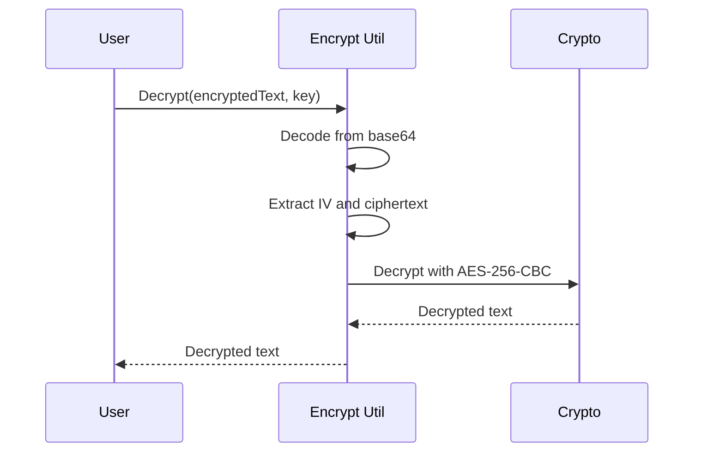
```mermaid
sequenceDiagram
    participant U as User
    participant E as Encrypt Util
    participant C as Crypto

    U->>E: Decrypt(encryptedText, key)
    E->>E: Decode from base64
    E->>E: Extract IV and ciphertext
    E->>C: Decrypt with AES-256-CBC
    C-->>E: Decrypted text
    E-->>U: Decrypted text
```

## 19. Secuencia de FileReaderService

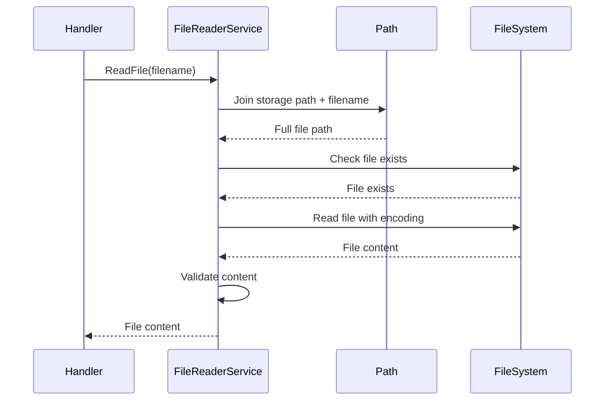
```mermaid
sequenceDiagram
    participant H as Handler
    participant F as FileReaderService
    participant P as Path
    participant FS as FileSystem

    H->>F: ReadFile(filename)
    F->>P: Join storage path + filename
    P-->>F: Full file path
    F->>FS: Check file exists
    FS-->>F: File exists
    F->>FS: Read file with encoding
    FS-->>F: File content
    F->>F: Validate content
    F-->>H: File content
```

## 20. Secuencia de Comando GetConfig

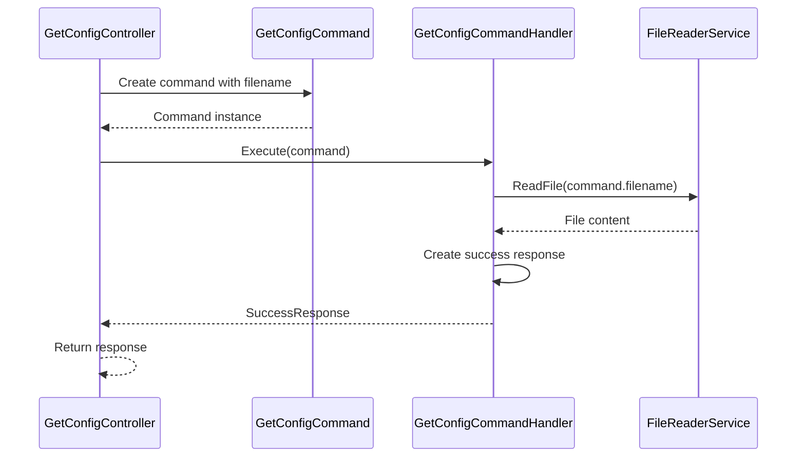
```mermaid
sequenceDiagram
    participant G as GetConfigController
    participant C as GetConfigCommand
    participant H as GetConfigCommandHandler
    participant F as FileReaderService

    G->>C: Create command with filename
    C-->>G: Command instance
    G->>H: Execute(command)
    H->>F: ReadFile(command.filename)
    F-->>H: File content
    H->>H: Create success response
    H-->>G: SuccessResponse
    G-->>G: Return response
``` 